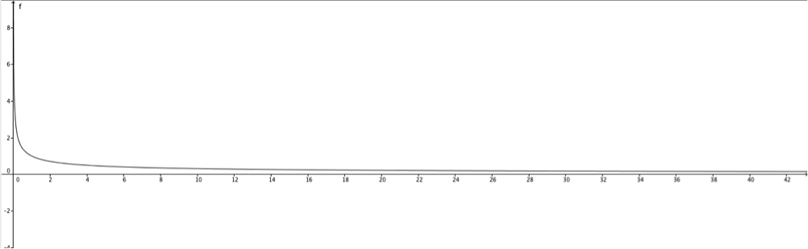
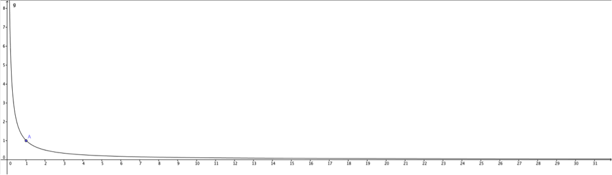
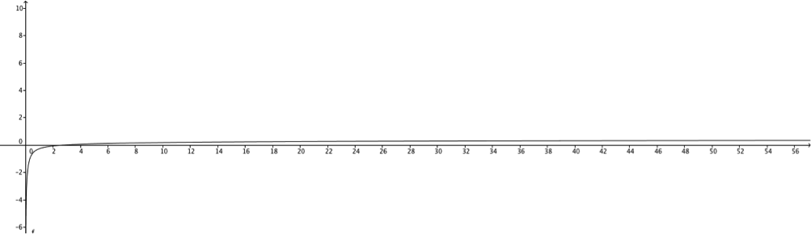
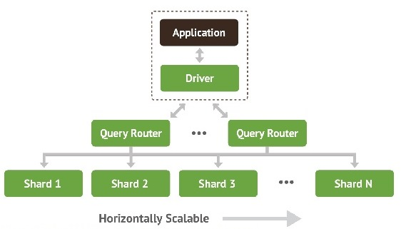

:stem:

== Analisi delle tecnologie adoperate
Le tecnologie più innovative impiegate nel progetto sono il protocollo CoAP, MongoDB e il cloud. Esse sono
strettamente collegate tra loro e l'impiego di una, spesso, implica anche quello di un'altra.

Il CoAP, ad esempio, è utilizzato nell'ambito dell'IoT, l'internet delle cose, un nuovo trend che vede protagonisti gli oggetti che comunicano con la rete per inviare e ricevere dati. Il problema è che gli oggetti collegati ad internet saranno moltissimi e, di conseguenza, la mole di dati prodotta sarà così grande da non potere essere gestita da un solo server, per quanto potente esso possa essere. Si sente dunque l'esigenza di passare da un approccio verticale, in cui si potenzia sempre di più un server centrale, a un approccio orizzontale, in cui si aggiungono altre macchine a cooperare tra di loro, ovvero da un sistema centralizzato a uno distribuito.

Quest'ultimo sistema è detto Cloud e può essere sia a livello applicativo sia a livello dati. Per utilizzare il cloud a livello dati non possono essere utilizzate le tecnologie dei database relazionali, poiché questi presuppongono che tutte le tabelle del database siano contenute su una sola macchina, ma si devono impiegare i database non relazionali, in quanto questi ultimi consentono di distribuire i dati di uno stesso database su più server.

Un esempio di Database Management System non relazionale è MongoDB, poiché si allontana dalla struttura tradizionale basata sulle tabelle dei database relazionali in favore di documenti in stile JSON con schema dinamico rendendo, così, l'integrazione di dati di alcuni tipi di applicazioni più facile e veloce. Tra i vari DBMS non relazionali si è scelto MongoDB perché è un software libero, open souce, stabile e ben documentato. Inoltre è utilizzato come backend da un alto numero di grandi siti web e società di servizi come eBay, Foursquare, SourceForge e il New York Times footnoteref:[wiki-MongoDB,fonte: https://it.wikipedia.org/wiki/MongoDB].
Dopo aver spiegato il perché della scelta di queste tecnologie, di seguito verranno approfondite una per una.

=== CoAP
[quote, http://coap.technology/]
Il Constrained Application Protocol (CoAP) è un protocollo di trasferimento web specializzato per l’uso con nodi vincolati e reti vincolate nel contesto dell’Internet delle cose.

Il protocollo è di tipo RESTful e di livello applicativo, mentre la definizione e la descrizione di “nodi vincolati”
e “reti vincolate” si può trovare nell’RFC 7228 footnote:[http://tools.ietf.org/html/rfc7228].

==== Nodi vincolati
Un nodo vincolato è un nodo dove alcune delle caratteristiche che molto spesso sono date per scontate per i classici nodi di internet non sono presenti, spesso a causa di vincoli di costo e/o fisici come la dimensione, il peso e la potenza e l’energia disponibili.

In primo luogo vi sono limiti stretti su potenza, memoria e capacità di elaborazione delle risorse che rendono l’ottimizzazione di energia, codice e larghezza di banda una parte importante dei requisiti di progettazione. Inoltre, servizi di secondo livello come connettività completa, broadcast e multicast talvolta possono anche mancare.

Un altro vincolo può essere quello della mancanza di una interfaccia utente e della scarsa accessibilità in distribuzione che può comportare, per esempio, l’impossibilità di aggiornare il software.

Anche se questa non è una definizione rigorosa, definisce chiaramente il distacco tra i nodi vincolati e altri sistemi più potenti come i server tradizionali, computer desktop, laptop o potenti dispositivi mobile come tablet e smartphone.

L’uso di nodi vincolati spesso porta anche a vincoli sulle reti stesse, ma ci possono anche essere vincoli sulle reti che sono ampiamente indipendenti da quelli dei nodi. Per questo motivo si distinguono i “nodi vincolati” dalle “reti vincolate”.

==== Reti vincolate
Le reti vincolate sono definite come reti in cui alcune delle caratteristiche date per scontato con gli strati di collegamento di uso comune nelle reti dell’internet odierna non sono disponibili e, quindi, vi sono dei vincoli di progettazione. Questi vincoli possono includere:

* bassa bitrate;
* perdita di pacchetti e alta variabilità della perdita di pacchetti;
* caratteristiche di collegamento molto asimmetriche;
* severe penalità per l’utilizzo di pacchetti di grandi dimensioni (ad esempio a causa di un alto tasso di perdita di pacchetti);
* limiti di raggiungibilità nel tempo, poichè un numero considerevole di dispositivi potrebbe spegnersi in qualsiasi
momento, per poi svegliarsi e comunicare per un breve periodo di tempo;
* mancanza di servizi avanzati come il multicast.

==== Il protocollo
Il CoAP, dunque, è stato creato per risolvere e nascondere al programmatore quasi tutte le problematiche elencate sia
per i nodi che per le reti vincolate e presenta le seguenti caratteristiche:

* è basato sul modello REST quindi, come per l'HTTP, i server rendono disponibili le risorse attraverso una URL e i client accedono a queste risorse usando metodi come GET, PUT, POST e DELETE;
* riesce a utilizzare risorse minime, sia sul dispositivo che sulla rete, perché invece di uno stack di trasporto complesso come il TCP, lavora con l'UDP, che non è orientato alla connessione e non implementa i controlli del flusso e della congestione, più adatti per scambiare messaggi di grosse dimensioni.
Inoltre presenta un header fissato a quattro byte e una codifica compatta di opzioni, che consentono ai piccoli messaggi di non causare frammentazione;
* molti server possono operare senza stato;
* chiavi RSA a 3072 bit come scelta predefinita dei parametri DTLS. Questo aspetto è molto importante, infatti una delle cose che impedisce di più all'IoT di diffondersi è la questione della sicurezza. A tal proposito il CoAP offre una protezione avanzata senza per questo compromettere il funzionamento persino sui nodi meno potenti;
* collegamento semplice tra HTTP e CoAP mediante proxy cross-protocol, dal momento che condividono lo stesso modello REST: un web client che utilizza HTTP può anche non accorgersi che sta accedendo a una risorsa di un sensore, in quanto il server CoAP locale può occuparsi di inoltrare ai nodi della sottorete le richieste in CoAP, traducendole da quelle HTTP originali;
* servizi di discovery già integrati nel protocollo, in quanto è già presente un modo per scoprire le proprietà dei nodi della rete;
* come HTTP, il CoAP può trasportare diversi tipi di payload e può anche identificare che tipo di payload si sta usando, compresi formati come XML, JSON, CBOR e molti altri che sono già integrati di base;
* ottimizzato per funzionare anche su controllori con 10KB di RAM e 100KB di spazio di codice. Per capire l'importanza e la potenzialità di questa caratteristica basta pensare che si prevede che l'Internet of Things avrà bisogno di miliardi di nodi. Ovviamente meno questi nodi saranno costosi, più grande sarà il risparmio complessivo, quindi avere un protocollo che funziona bene anche su dispositivi con prestazioni estremamente basse è essenziale;
* osservazione di risorse con il modello publish/subscribe, ovvero un server notifica i client che si sono registrati a una specifica risorsa quando questa cambia;
* resource discovery già integrata e supporto a trasmissione di grandi quantità di dati, suddividendo i dati in blocchi nel mittente e ricomponendoli al livello applicativo in ricezione (questa feature è chiamata block-wise transfer);
* supporto nativo al multicast;
* affidabilità della comunicazione. Nonostante il CoAP sia basato su UDP, infatti, è implementato un meccanismo per garantire che i messaggi siano stati ricevuti dal destinatario. In particolare, per un determinato intervallo di tempo, quando si invia un pacchetto si aspetta un ACK, che può contenere anche un eventuale payload e, se questo non arriva, viene ritrasmesso il messaggio; al termine dell'intervallo il pacchetto si considera scaduto e, quindi, non ricevuto dal destinatario.

Tutte queste caratteristiche rendono il CoAP il protocollo ideale per impieghi che rientrano nelle architetture dell'IoT.

=== Cloud

Per approfondire la tecnologia del Cloud sono stati letti e analizzati vari articoli di Joe Wienman, il fondatore di Cloudonomics, un
rigoroso approccio analitico e multidisciplinare che coinvolge economia, economia comportamentale, statistica, matematica, teoria della complessità computazionale, simulazione e teoria dei sistemi per caratterizzare il talvolta poco intuitivo business multi-dimensionale e i benefici dell’esperienza utente del cloud computing e di altri modelli di business on-demand e pay-per-use footnote:[fonte: http://www.joeweinman.com/bio.htm].

==== Che cos'è

[quote, Peter Mell&#44; Timothy Grance, The NIST Definition of Cloud Computing. NIST&#44; Special Publication 800-145&#44; Settembre 2011.]
In informatica con il termine inglese cloud computing (in italiano "nuvola informatica") si indica un paradigma di erogazione di risorse informatiche, come l'archiviazione, l'elaborazione o la trasmissione di dati, caratterizzato dalla disponibilità on demand attraverso Internet a partire da un insieme di risorse preesistenti e configurabili.

Le risorse non vengono pienamente configurate e messe in opera dal fornitore apposta per l'utente, ma gli sono assegnate, rapidamente e convenientemente, grazie a procedure automatizzate, a partire da un insieme di risorse condivise con altri utenti, lasciando all'utente parte dell'onere della configurazione. Quando l'utente rilascia la risorsa, essa viene similmente riconfigurata nello stato iniziale e rimessa a disposizione nel pool condiviso delle risorse, con altrettanta velocità ed economia per il fornitore footnote:[https://it.wikipedia.org/wiki/Cloud_computing].

Alcuni esempi che mostrano le potenzialità del cloud sono:

* Messaggiare tramite smartphone;
* Condividere foto e aggiornamenti su Facebook o Twitter;
* Guardare un video di Youtube su una TV;
* Condividere file su Dropbox.

Ma oltre a queste applicazioni che coinvolgono l’uomo, ve ne sono molte altre che coinvolgono le macchine (IoT), in cui una varietà di
endpoints sono connessi al cloud:

* Telecamere di videosorveglianza che mandano video in diretta a un archivio di video basato sul cloud per una maggiore sicurezza;
* Device che monitorano continuamente alcuni parametri dei pazienti, come la pressione sanguigna, i battiti cardiaci, che possono
essere mandati all’ospedale più vicino in caso di valori al di fuori del normale;
* Case intelligenti con dispositivi in grado di spegnere ed accendere a distanza dispositivi ad alto consumo come condizionatori,
lavatrici, asciugatrici e lavastoviglie, in modo da ridurre al minimo i consumi;
* Fattorie che monitorano lo stato dell’ambiente, come la temperatura, le precipitazioni, per assicurare che il terreno riceva esattamente
l’irrigazione necessaria. footnote:[Joe Weinman, “Defining a cloud”, http://www.techradar.com/news/internet/cloud-services/defining-a-cloud-1209348]

==== Caratteristiche
Un'analisi delle caratteristiche principali di un servizio cloud-based viene effettuata nell'articolo di Joe Weinman
"Cloudonomics: A Rigorous Approach to Cloud Benefit Quantification" footnote:[Ottobre 2011, https://www.csiac.org/sites/default/files/journal_files/stn14_4.pdf]. Esse sono:

===== Infrastruttura __C__omune
Le risorse sono standardizzate, condivise e allocate dinamicamente.

La penalità del costo del servizio segue la funzione
// 1/sqrt(m)
pass:[<math xmlns="http://www.w3.org/1998/Math/MathML">
  <mstyle displaystyle="true">
    <mfrac>
      <mn>1</mn>
      <msqrt>
        <mi>m</mi>
      </msqrt>
    </mfrac>
  </mstyle>
</math>]
, dove m sta per il numero di richieste indipendenti che riceve il sistema. Questo vuol dire che più richieste ci sono, più il costo che si paga per mantenere il servizio è “giustificato”, perché lo si sta sfruttando. Se invece ci sono poche richieste rispetto a quelle supportate, il costo che si sta pagando per gestire più richieste è, ovviamente, uno spreco.

[[img-function1]]
.Andamento della penalità del costo del servizio

Come si nota dal grafico la funzione è decrescente, quindi più m è grande, più la penalità del costo si abbassa, ma se m aumenta troppo bisogna aumentare la capacità del sistema e, quindi, investire altri soldi in esso perchè, se la capacità del sistema sarà troppo piccola rispetto alle richieste ricevute, quest'ultimo soffrità di un'alta latenza e verrà a mancare la reattività dell’applicazione del consumatore.

===== Indipendenza dalla __L__ocazione
La reattività del servizio non tiene conto della posizione dell’utente, perchè i server possono essere sparsi ovunque, con benefici derivanti dalla riduzione della latenza e la valorizzazione dell’esperienza dell’utente.

La latenza è fortemente, ma non perfettamente, correlata con la distanza. La ragione di questa imperfezione ha a che fare con le anomalie a livello fisico della rete, come gli hop dei router, il tempo di conversione tra ottico ed elettronico e viceversa, le congestioni, i collegamenti antiquati, ecc.

Su un piano, sia per il caso peggiore sia per quello atteso, la latenza è proporzionale al raggio del cerchio centrato sul nodo. Di conseguenza, l’area coperta è proporzionale al raggio e al numero di nodi (Weinman, 2011).

In particolare, per n nodi su un piano, l’area A coperta dipende dal raggio r, correlato con la latenza/distanza, e una costante di proporzionalità k che dipende dalla strategia di copertura. Si deduce, dunque, che
// A=knπr^2
pass:[<math xmlns="http://www.w3.org/1998/Math/MathML">
  <mstyle displaystyle="true">
    <mi>A</mi>
    <mo>=</mo>
    <mi>k</mi>
    <mi>n</mi>
    <mo>&#x3C0;</mo>
    <msup>
      <mi>r</mi>
      <mn>2</mn>
    </msup>
  </mstyle>
</math>]. Pertanto, se l’area A è una costante, si ricava che
// r∝1/(sqrt(n))
pass:[<math xmlns="http://www.w3.org/1998/Math/MathML">
  <mstyle displaystyle="true">
    <mi>r</mi>
    <mo>&#x221D;</mo>
    <mfrac>
      <mn>1</mn>
      <mrow>
        <msqrt>
          <mrow>
            <mi>n</mi>
          </mrow>
        </msqrt>
      </mrow>
    </mfrac>
  </mstyle>
</math>]
dove n sta per il numero di nodi aggiustato di un fattore
// (1-cos(2β))/(1-cos(β))
pass:[<math xmlns="http://www.w3.org/1998/Math/MathML">
  <mstyle displaystyle="true">
    <mfrac>
      <mrow>
        <mn>1</mn>
        <mo>-</mo>
        <mrow>
          <mi>cos</mi>
          <mrow>
            <mo>(</mo>
            <mn>2</mn>
            <mi>&#x3B2;</mi>
            <mo>)</mo>
          </mrow>
        </mrow>
      </mrow>
      <mrow>
        <mn>1</mn>
        <mo>-</mo>
        <mrow>
          <mi>cos</mi>
          <mrow>
            <mo>(</mo>
            <mi>&#x3B2;</mi>
            <mo>)</mo>
          </mrow>
        </mrow>
      </mrow>
    </mfrac>
  </mstyle>
</math>]. Quindi, come si deduce dall’andamento della funzione, se si hanno pochi nodi e se ne aggiungono altri, si ottiene un miglioramento notevole nella latenza mentre, se di base si hanno già molti nodi, il miglioramento sarà esiguo.

Si faccia un esempio trascurando il fattore di aggiustamento e supponendo di avere un servizio che viene offerto a 100000 utenti, in cui ogni richiesta da parte di un utente impieghi un tempo di elaborazione di 1ms e che 20200 di questi utenti facciano richiesta contemporaneamente. Se si avesse solamente un nodo, il sistema sarebbe pronto ad accettare nuove richieste dopo 20,2 secondi. Se aggiungessimo un altro nodo 10100 utenti verrebbero diretti verso il primo nodo e altri 10100 verso l’altro, quindi da 20,2 secondi un ipotetico 202001° utente che faccia richiesta qualche istante dopo arriverebbe ad aspettare 10,1 secondi, ottenendo un miglioramento del 50%. Si ponga, invece, il caso in cui il sistema sia formato da 100 nodi. Per lo stesso numero di richieste ogni nodo ne gestirebbe 202 e, quindi, il sistema sarebbe pronto a gestire nuove richieste dopo 202ms. Se si aggiungesse 1 nodo al sistema, ogni nodo gestirebbe 200 nodi e quindi il sistema sarebbe pronto dopo 200ms piuttosto che 202ms. Come si nota dai risultati, il miglioramento, che nel primo caso era di ben 10,1 secondi, ora è solo di 2ms, cioè appena dello 0,99%.

Per quanto riguarda il fattore di aggiustamento esso serve a tenere in considerazione la distanza tra nodo e utente, che ovviamente più è elevata, più va a pesare sulla latenza. β è l’angolo formato dal nodo e dall’utente, con vertice preso al centro della terra. Questo coefficiente è molto significativo quando i nodi non sono dislocati in maniera omogenea sul pianeta, mentre se ci sono molti nodi ben disseminati sulla superficie terrestre β sarà molto piccolo, perché ogni utente avrà un nodo vicino ad esso e quindi il fattore tenderà ad 1.

===== Accessibilità __O__line
Un servizio cloud-based è più flessibile rispetto ad uno centralizzato.

Quando si esamina la connettività, il costo potrebbe essere semplice da calcolare: dollari per Gigabyte trasferiti o il costo di router o strutture ottiche, ma il valore è difficile da quantificare, dal momento che è una esternalità. Un buon approccio è di considerarne il costo marginale e usarlo per compensare i benefici connessi con il cloud puro o ibrido.

E’ stato calcolato che una struttura ad hub rispetto ad una P2P ha un beneficio di
// 1/n
pass:[<math xmlns="http://www.w3.org/1998/Math/MathML">
  <mstyle displaystyle="true">
    <mfrac>
      <mn>1</mn>
      <mi>n</mi>
    </mfrac>
  </mstyle>
</math>], dove n sta per il numero di connessioni. Ecco il grafico di questa funzione:

[[img-function2]]
.Andamento del beneficio di una struttura ad hub rispetto ad una P2P

Come si può notare notare, da un punto di vista prestazionale, il P2P conviene praticamente sempre, tranne nel caso in cui vi sia un solo nodo, ma per una maggiore facilità di gestione a volte si preferisce adoperare comunque una struttura centralizzata.
Utilizzando politiche smart all’interno di una infrastruttura di rete (il che significa non utilizzare algoritmi semplici come FCFS o Round Robin per il bilanciamento del carico, ma utilizzare metodi più intelligenti) porta a un miglioramento di
// 1/2+1/(n+1)-sqrt(π/2n)
pass:[<math xmlns="http://www.w3.org/1998/Math/MathML">
  <mstyle displaystyle="true">
    <mfrac>
      <mn>1</mn>
      <mn>2</mn>
    </mfrac>
    <mo>+</mo>
    <mfrac>
      <mn>1</mn>
      <mrow>
        <mi>n</mi>
        <mo>+</mo>
        <mn>1</mn>
      </mrow>
    </mfrac>
    <mo>-</mo>
    <msqrt>
      <mrow>
        <mfrac>
          <mi>&#x3C0;</mi>
          <mn>2</mn>
        </mfrac>
        <mi>n</mi>
      </mrow>
    </msqrt>
  </mstyle>
</math>] dove n sta per il numero di path.
Ecco il grafico:

[[img-function3]]
.Andamento dei benefici che l'utilizzo di politiche smart porta all’interno di una infrastruttura di rete

===== Prezzi vantaggiosi (__U__tility pricing)
Con il cloud vi è la possibilità di pagare le risorse solo al momento dell’uso effettivo, con benefici apprezzabili soprattutto per gli ambienti con livelli di domanda variabile.

Il cloud, per definizione, è utile quando costa meno di realizzare un sistema privato o quando il carico di lavoro è molto variabile. Se il numero di richieste subisce molti sbalzi, infatti, significa che il sistema deve essere pronto a ricevere in ogni momento il picco più alto di traffico che potrebbe arrivare, mentre il cloud permette di richiedere le esatte risorse che servono in quel determinato momento, senza sprechi e pagando effettivamente solo per le risorse utilizzate.

Si consideri una richiesta di risorse variabile nel tempo e la si indichi con D(t) con
//0 <= t <= T
pass:[<math xmlns="http://www.w3.org/1998/Math/MathML">
  <mstyle displaystyle="true">
    <mn>0</mn>
    <mo>&#x2264;</mo>
    <mi>t</mi>
    <mo>&#x2264;</mo>
    <mi>T</mi>
  </mstyle>
</math>]. La richiesta di picco sarà dunque
//P=max(D(t))
pass:[<math xmlns="http://www.w3.org/1998/Math/MathML">
  <mstyle displaystyle="true">
    <mi>P</mi>
    <mo>=</mo>
    <mo>max</mo>
    <mrow>
      <mo>{</mo>
      <mi>D</mi>
      <mrow>
        <mo>(</mo>
        <mi>t</mi>
        <mo>)</mo>
      </mrow>
      <mo>}</mo>
    </mrow>
  </mstyle>
</math>], mentre la domanda media sarà
// A=µ(D(t))
pass:[<math xmlns="http://www.w3.org/1998/Math/MathML">
  <mstyle displaystyle="true">
    <mi>A</mi>
    <mo>=</mo>
    <mi>&#x3BC;</mi>
    <mrow>
      <mo>{</mo>
      <mi>D</mi>
      <mrow>
        <mo>(</mo>
        <mi>t</mi>
        <mo>)</mo>
      </mrow>
      <mo>}</mo>
    </mrow>
  </mstyle>
</math>].
Sia il premio dell’utilità U il rapporto tra il costo per l’utilizzo di una unità del cloud e quello per l’utilizzo di un’unità dedicata. Ad esempio se si decide che si ha bisogno di una macchina, quest'ultima può essere comprata a rate (ad esempio per 300€ al mese) o affittata quando ci serve (ad esempio a 45€ al giorno). 300€ mensili al giorno vogliono dire circa 10€, quindi U = 4,5 (= 45€ / 10€). B sarà il costo di base per le risorse di proprietà.

Il prezzo per un utilizzo medio deve tenere in conto A, non P, quindi il costo totale per la richiesta di risorse D(t) sarà dato da A×U×B×T, che è il valore dell’integrale definito
//int_0^T U×B×D(t)dt
pass:[<math xmlns="http://www.w3.org/1998/Math/MathML">
  <mstyle displaystyle="true">
    <mrow>
      <msubsup>
        <mo>&#x222B;</mo>
        <mn>0</mn>
        <mi>T</mi>
      </msubsup>
    </mrow>
    <mi>U</mi>
    <mo>&#xD7;</mo>
    <mi>B</mi>
    <mo>&#xD7;</mo>
    <mi>D</mi>
    <mrow>
      <mo>(</mo>
      <mi>t</mi>
      <mo>)</mo>
    </mrow>
    <mrow>
      <mi>d</mi>
      <mi>t</mi>
    </mrow>
  </mstyle>
</math>]. Per una soluzione con risorse proprietarie non esiste il concetto di pay-per-use, quindi il prezzo pagato sarà sempre quello riguardante la richiesta di picco, non quella media, quindi il prezzo totale sarà dato da P×B×T. Per avere un costo minore delle risorse on-demand rispetto a quelle proprietarie si deve avere
//A×U×B×T<P×B×T
pass:[<math xmlns="http://www.w3.org/1998/Math/MathML">
  <mstyle displaystyle="true">
    <mi>A</mi>
    <mo>&#xD7;</mo>
    <mi>U</mi>
    <mo>&#xD7;</mo>
    <mi>B</mi>
    <mo>&#xD7;</mo>
    <mi>T</mi>
    <mo>&lt;</mo>
    <mi>P</mi>
    <mo>&#xD7;</mo>
    <mi>B</mi>
    <mo>&#xD7;</mo>
    <mi>T</mi>
  </mstyle>
</math>]. La B e la T si semplificano, portando alla soluzione che il cloud è più economico quando
// P/A > U
pass:[<math xmlns="http://www.w3.org/1998/Math/MathML">
  <mstyle displaystyle="true">
    <mfrac>
      <mi>P</mi>
      <mi>A</mi>
    </mfrac>
    <mo>&gt;</mo>
    <mi>U</mi>
  </mstyle>
</math>]. Si deduce, dunque, che se il costo di un’unità del cloud è U volte più grande di quello di una risorsa dedicata, ma il rapporto tra la richiesta di picco e quella media è superiore ad U, una soluzione di tipo cloud sarà sempre meno costosa.

===== Risorse on-__D__emand
Il valore dell’on-Demand consiste nell’avere sempre l’esatto numero di risorse di cui si ha bisogno in ogni momento e con il cloud si può raggiungere questo risultato. In base alla richiesta, infatti, si possono ottenere o rilasciare risorse dal cloud provider che si utilizza.

Si considerino i costi di penalizzazione associati all’insufficienza e all’eccesso di risorse. Se si indica con D la domanda e con R le risorse, il costo di penalizzazione è proporzionale a |D-R|. Se la domanda e le risorse sono tempo varianti, invece, il costo di penalizzazione è proporzionale a
// int |D(t)-R(t)|dt
pass:[<math xmlns="http://www.w3.org/1998/Math/MathML">
  <mstyle displaystyle="true">
    <mo>&#x222B;</mo>
    <mrow>
      <mo>|</mo>
      <mi>D</mi>
      <mrow>
        <mo>(</mo>
        <mi>t</mi>
        <mo>)</mo>
      </mrow>
      <mo>-</mo>
      <mi>R</mi>
      <mrow>
        <mo>(</mo>
        <mi>t</mi>
        <mo>)</mo>
      </mrow>
      <mo>|</mo>
    </mrow>
    <mrow>
      <mi>d</mi>
      <mi>t</mi>
    </mrow>
  </mstyle>
</math>].

Se la domanda è costante, basta il resourcing tradizionale mentre, se non è lineare o se non è prevedibile, allora sorgono dei problemi e le risorse on-demand diventano indispensabili.

Si dimostra ora che la penalità del costo di un servizio centralizzato aumenta esponenzialmente con il tempo se la funzione della domanda è esponenziale.

Data una richiesta uniformemente distribuita da 0 a P, in un tempo T, con una penalità del costo del servizio di c, la penalità totale per risorse fissate, anche se si imposta il livello in modo ottimale, sarà
// 1/6×P×T×c
pass:[<math xmlns="http://www.w3.org/1998/Math/MathML">
  <mstyle displaystyle="true">
    <mfrac>
      <mn>1</mn>
      <mn>6</mn>
    </mfrac>
    <mo>&#xD7;</mo>
    <mi>P</mi>
    <mo>&#xD7;</mo>
    <mi>T</mi>
    <mo>&#xD7;</mo>
    <mi>c</mi>
  </mstyle>
</math>].

Quando la funzione della domanda è esponenziale, ovvero
//D(t)=e^t
pass:[<math xmlns="http://www.w3.org/1998/Math/MathML">
  <mstyle displaystyle="true">
    <mi>D</mi>
    <mrow>
      <mo>(</mo>
      <mi>t</mi>
      <mo>)</mo>
    </mrow>
    <mo>=</mo>
    <msup>
      <mi>e</mi>
      <mi>t</mi>
    </msup>
  </mstyle>
</math>], e l’intervallo di risorse fisso è k, le risorse saranno
// R(t)=e^(t-k)
pass:[<math xmlns="http://www.w3.org/1998/Math/MathML">
  <mstyle displaystyle="true">
    <mi>R</mi>
    <mrow>
      <mo>(</mo>
      <mi>t</mi>
      <mo>)</mo>
    </mrow>
    <mo>=</mo>
    <msup>
      <mi>e</mi>
      <mrow>
        <mi>t</mi>
        <mo>-</mo>
        <mi>k</mi>
      </mrow>
    </msup>
  </mstyle>
</math>], quindi la penalità del costo del servizio sarà dato da
// D(t)-R(t)=e^t-e^(t-k)=e^t (1-e^(-k))
pass:[<math xmlns="http://www.w3.org/1998/Math/MathML">
  <mstyle displaystyle="true">
    <mi>D</mi>
    <mrow>
      <mo>(</mo>
      <mi>t</mi>
      <mo>)</mo>
    </mrow>
    <mo>-</mo>
    <mi>R</mi>
    <mrow>
      <mo>(</mo>
      <mi>t</mi>
      <mo>)</mo>
    </mrow>
    <mo>=</mo>
    <msup>
      <mi>e</mi>
      <mi>t</mi>
    </msup>
    <mo>-</mo>
    <msup>
      <mi>e</mi>
      <mrow>
        <mi>t</mi>
        <mo>-</mo>
        <mi>k</mi>
      </mrow>
    </msup>
    <mo>=</mo>
    <msup>
      <mi>e</mi>
      <mi>t</mi>
    </msup>
    <mrow>
      <mo>(</mo>
      <mn>1</mn>
      <mo>-</mo>
      <msup>
        <mi>e</mi>
        <mrow>
          <mo>-</mo>
          <mi>k</mi>
        </mrow>
      </msup>
      <mo>)</mo>
    </mrow>
  </mstyle>
</math>].

Come è possibile notare, ogni intervallo di risorse fisso che cerca di soddisfare la domanda in base al suo livello corrente ha una penalità del costo del servizio che cresce esponenzialmente con il tempo, quindi in presenza di una domanda che con andamento esponenziale non conviene utilizzare un servizio centralizzato.

==== Perchè utilizzarlo
Il cloud ormai fa parte della vita di tutti i giorni: da consumatori, si spende parte del tempo su social network basati sul cloud e
usando app scaricate dal cloud e, a livello lavorativo, si usano svariati programmi basati sul cloud.
I vantaggi legati al cloud e i motivi per cui le compagnie dovrebbero aggiornare i loro sistemi a questa tecnologia sono molteplici:

* riduzione dei costi;
* incremento della “business agility”;
* miglioramento dell’esperienza dell’utente, riducendo la latenza dei servizi interattivi;
* aumento delle capacità computazionali, offrendo la possibilità di far cooperare insieme un numero di risorse “vicino all’infinito”.

Bisogna però specificare che il cloud, come anche big data, social e IoT, diventa particolarmente efficace quando le compagnie lo utilizzano
 per ottenere vantaggi strategici.
Vi sono quattro principali modi mediante i quali le compagnie utilizzano il cloud:

Information excellence:: Le aziende sfruttano le informazioni per ottimizzare dinamicamente la produzione, i servizi e
altri processi di business. L’analisi ha portato da sempre a un processo di miglioramento a lungo termine, a maggior ragione
in questo momento, in cui i dati sono accessibili in tempo reale e possono essere sottoposti ad algoritmi di analisi che
portano a una riduzione notevole dei costi;

Solution leadership:: Creazione di prodotti e servizi differenziati e collegati alla rete mediante servizi basati sul
cloud. Le macchine di ultima generazione o sistemi di monitoraggio di attività, sono alcuni degli esempi di questa nuova
generazione di soluzioni capace di interfacciarsi ad internet;

Collective intimacy:: Raccolta massiccia di dati degli utenti, in modo da estrapolarne preferenze e abitudini e per
fornire, quindi, delle raccomandazioni individuali mirate a ciascun cliente. Un esempio sono raccomandazioni di film o libri,
ma anche la generazione di terapie mediche per i pazienti basate sulle caratteristiche di ogni individuo e sui suoi sintomi;

Accelerated innovation:: L'insieme di tutti quei processi che consentono di portare avanti l’innovazione ancora più velocemente. Alcuni
esempi possono essere esperimenti a basso costo, crowdfunding e crowdsourcing.
Il cloud, inoltre, permette di far interagire tra di loro i dispositivi che fanno parte dell’IoT permettendo, ad esempio,
l’ottimizzazione delle smart city in modo da avere una sincronizzazione di scuola bus, ambulanze, ecc. footnote:[Joe Weinman, "What's the real reason to do cloud, again?“, 3 ottobre 2014. http://www.cloudcomputing-news.net/news/2014/oct/03/whats-the-real-reason-to-do-cloud-again/]

==== Aspetti economici
La crescita esplosiva del Cloud è dovuta ai benefici finanziari e strategici e la tariffazione pay-per-use è un attributo di base.
Qualcuno dice che la riduzione dei costi e la business agility sono i due più importanti benefici del Cloud, altri indicano
l’economia di scala dai grandi fornitori come principali benefici del cloud e altri prevedono che tutta l’IT si sposterà nel cloud.

Quando si considerano i costi di un sistema, non bisogna solamente guardare al costo delle unità, ma anche al loro utilizzo.
Se si usa solo il 33% di un sistema, significa che per ogni risorsa utilizzata ce ne sono 2 inutilizzate e il costo effettivo delle unità, dunque, triplica. Quando si considerano le unità, il prezzo è visibile nel loro costo, mentre quando si guarda all’utilizzo, un prezzo alto può essere causato da una scarsa gestione delle risorse, ma anche dall’inevitabile risultato di picchi di carichi di lavoro in presenza di capacità fissata.

Anche se il cloud teoricamente ottimizza i costi, ci sono alcune spese addizionali da tenere in conto:

* La ricerca per trovare il giusto provider, anche se intermediari come broker possono aiutare;
* Il costo per migrare le applicazioni a una architettura di tipo cloud se queste non sono state pensate fin dall’inizio per esso;
* Costi di tipo tecnologico, come infrastrutture di rete, trasferimento dei dati o tool di gestione;
* I costi di un'organizzazione che revisiona il servizio offerto dal provider.

Avere la giusta quantità di risorse per soddisfare le richieste ha un chiaro beneficio economico. Se vi sono troppe risorse, infatti, significa che parte del capitale usato per esse poteva essere investito diversamente o risparmiato mentre, se ve ne sono poche, l’applicazione funzionerà lentamente o non funzionerà del tutto. Se non si ha la possibilità di fare una stima di questa quantità è consigliabile affidarsi (anche parzialmente) al cloud pubblico che, mediante risorse su richiesta, garantisce sempre la giusta quantità di risorse.

Tuttavia, se l’andamento delle richieste è completamente piatto, non c’è un vero motivo per affidarsi a servizi on-demand, se non per non rimanere impreparati alla possibilità che questo andamento possa diventare esponenziale in futuro. In tal caso, infatti, affidarsi al cloud pubblico è vitale, poiché altrimenti alcune di queste richieste non saranno soddisfatte e, quindi, vi sarà una perdita economica.

Le infrastutture del cloud, tipicamente, sono geograficamente disperse per garantire una riduzione della latenza. Quest’ultima garantisce dei benefici in termini di business, infatti, tempi di caricamento minori implicano che più clienti possono visitare più pagine web e fare più acquisti o che gli impiegati possono essere più produttivi footnote:[Joe Weinman, The Nuances of Cloud Economics (le sfumature del Cloud Economics), http://ieeexplore.ieee.org/xpl/articleDetails.jsp?tp=&arnumber=7057586].

==== Cloud ibrido
La prospettiva economica di cloud privato o pubblico può essere semplificata nel seguente modo: il primo possiede risorse dedicate che sono proprietà dell’azienda che le utilizza e che richiedono un costo fisso indipendentemente da quante di queste risorse si stanno utilizzando, mentre il secondo ha delle risorse pronte all’uso, condivise anche con altre aziende e che vengono “affittate” all’occorrenza, quindi vi è un costo variabile in base a quanto le si utilizza. Per il cloud privato, dunque, vi sono delle risorse fisse, che sono quelle che l’azienda ha comprato e di cui si occupa di fare manutenzione, mentre per il cloud pubblico è possibile richiedere quante risorse servono, quindi si avrà una capacità variabile.

Qualsiasi mix di questi due approcci puri per andare incontro ai bisogni di una o più applicazioni può essere definito come architettura ibrida (Hybrid architecture).

Guardando anche ad altri settori si può notare che, sia il modello su cui si basa il cloud pubblico (a breve termine, su richiesta e con pagamento solo al momento dell’uso) sia quello su cui si basa il cloud privato (proprietà privata), esistono da moltissimo tempo ed hanno un grande successo a livello di business.

L’uomo, quindi, ha tratto i suoi vantaggi sia dall’uno sia dall’altro, dimostrando di non poter fare a meno di nessuno dei due: si immagini di non poter pagare un mutuo, di utilizzare solamente i mezzi pubblici, che tutte le luci degli appartamenti funzionassero solo ad energia solare, o ancora che non si potrebbero affittare stanze negli alberghi.

Quello che si fa in informatica, in questo caso, è quello che fa l’uomo tutti i giorni, ovvero prendere il meglio da entrambi i modelli pubblico e privato optando, quindi, per l’approccio ibrido.

In moltissimi settori gli approcci ibridi sono prevalenti, tra cui l’economia, l’ottimizzazione delle prestazioni o il comportamento umano.

In generale, in presenza di richieste variabili, le risorse ibride rappresentano un mix ottimale di un costo inferiore per le risorse dedicate che eseguono la parte di richieste costanti e per le risorse pay-per-use per la parte delle richieste variabili. Per richieste costanti si intendono quelle richieste che sono sempre presenti e che non dipendono da fattori esterni, mentre per richieste variabili si intendono quelle richieste che variano in modo imprevedibile.

L'approccio ottimale nella maggior parte dei casi, dunque, è utilizzare il cloud privato per le richieste che si presentano con costanza e che, quindi, sono prevedibili e utilizzare il cloud pubblico solamente nel caso di superamento della soglia di capacità del cloud privato, ovvero in presenza di richieste variabili.

Qualora i costi di uno dei due approcci dovessero abbassarsi, il cloud ibrido consentirebbe di espandersi verso l’approccio più economico, quindi vi è una flessibilità non indifferente. Investire tutti i propri investimenti in una propria infrastruttura, adottando quindi esclusivamente il modello del cloud privato, potrebbe rivelarsi una mossa totalmente errata se un domani i cloud provider abbassassero drasticamente il costo del cloud pubblico. D’altra parte, essere bloccato nel cloud pubblico potrebbe essere un problema nel caso in cui il proprio provider dovesse avere cali di perfomance, per esempio.

Lo spostamento di applicazioni da un ambiente privato al cloud pubblico può significare anche costi di migrazione, quindi è meglio adottare l’approccio ibrido fin da subito.

Una sottile differenza tra cloud pubblico e privato che viene spesso trascurata è quella delle prestazioni. Mentre il cloud pubblico offre numerose opzioni e configurazioni standard, il controllo finale sulle architetture fisiche si ha con le risorse di proprietà, che possono essere configurate con elementi infrastrutturali come memoria, core e svariate altre scelte che possono soddisfare esattamente le esigenze dell’applicazione. Un'architettura con elementi più costosi e adatti all’applicazione può offrire un migliore rapporto tra prestazioni e prezzo, ma si va incontro a una grossa perdita in termini di flessibilità.

Di seguito si analizzano gli scenari e le architetture in cui il cloud ibrido può essere impiegato.
Un ambiente di cloud computing ibrido comprende tipicamente risorse private, uno o più servizi di cloud pubblico ed i “load balancers”, bilanciatori di carico che instradano gli utenti alle risorse private o pubbliche.

In casi semplici, come la visualizzazione di pagine web statiche, i load balancers possono instradare gli utenti indifferentemente verso risorse private o pubbliche, altre volte il cloud può fungere da front-end e il data center aziendale da back-end o viceversa. Un esempio in cui il cloud funge da back-end e le risorse private da front-end potrebbe essere quello in cui gli ordini commerciali e le transazioni di un servizio di vendita vengono gestite all’interno del cloud privato, mentre il cloud pubblico si occupa del content delivery (distribuzione di contenuti) per un catalogo web-based e di contenere il database del catalogo.

Oltre al cloud nello spazio si può anche pensare al cloud nel tempo, anche se è una visione meno tradizionale. Vi sono quattro ibridi generici nel tempo:

* Lo sviluppo e il test dell’applicazione viene fatto nel cloud pubblico mentre, una volta che viene realizzata, l'applicazione viene eseguita all’interno del cloud privato aziendale;
* Nello scenario inverso al precedente, lo sviluppo e il test dell’applicazione viene fatto nel cloud privato o anche in un computer desktop o in una workstation mentre, quando l'applicazione è ultimata, viene spostata nel cloud pubblico;
* L’applicazione viene sia sviluppata che eseguita su cloud privato, ma viene spostata nel cloud pubblico a causa di strategie economiche o di altra natura;
* Nello scenario inverso al precedente, una società, magari una startup, basa la sua IT (tecnologia dell’informazione) inizialmente sul cloud pubblico e, una volta che raggiunge un certo potere economico decide di investire in un proprio data center, migrando le sue applicazioni nel cloud privato.

Molte combinazioni di tutti questi scenari si verificano continuamente sulla base dei requisiti di business.

Ad esempio, in un approccio che oggi è estremamente prevalente, diversi cloud provider pubblici integrano applicazioni o componenti nel data center aziendale, ad esempio la validazione di una carta di credito, un SaaS per il CRM (Customer relationship management), per la condivisione di documenti o per lo storage.

Idealmente la scelta di cloud pubblico, privato o ibrido dovrebbe essere completamente separata da quella dell’architettura dell’applicazione allo stesso modo di come, quando si compra una macchina, la scelta di affittarla, pagare in contanti o tramite rate non dovrebbe influenzare sulla scelta del modello della stessa.

I requisiti per attuare questa strategia sono semplici. L’applicazione dovrebbe essere distribuibile facilmente sia nel caso di cloud privato, pubblico o entrambi, senza riscrivere parti di codice e dovrebbero essere disponibili dei tool automatici di gestione per abilitare varie componenti dell’applicazione in modo da aumentare la scalabilità e spostare l’applicazione da cloud privato a pubblico e viceversa e per fornire dati chiave come le performance dell’applicazione e le differenze di costo, in modo da ottimizzare intelligentemente i due ambienti.

Dietro questi requisiti di alto livello vi sono tecnologie specifiche di migrazione di macchine virtuali, dischi rigidi virtuali, configurazione di gestione di reti private virtuali, sicurezza, ecc.
footnote:[fonte: Joe Weinman, "Hybrid Cloud: The Best of Both Worlds", http://blogs.technet.com/b/server-cloud/archive/2015/02/04/hybrid-cloud-the-best-of-both-worlds-an-introduction-to-the-benefits-of-hybrid-cloud.aspx]

=== MongoDB
[quote, https://docs.MongoDB.org/manual/]
MongoDB è un database open-source, basato sui documenti e progettato per la facilità di sviluppo e scalabilità.

MongoDB (da "hu**mongo**us", enorme) è il più popolare DBMS non relazionale, ovvero di tipo NoSQL. Esso, dunque, non presenta la struttura tradizionale basata su tabelle dei database relazionali, ma adotta dei documenti in stile JSON con schema dinamico, rendendo l'integrazione di dati di alcuni tipi di applicazioni più facile e veloce footnoteref:[wiki-MongoDB]. Basti pensare che il JSON è uno dei formati più utilizzati per l’invio di strutture su internet per cui, la maggior parte delle volte, è immediato prendere le informazioni da questi file e inserirli nel database.

==== I documenti
I documenti sono gli analoghi delle strutture dei linguaggi di programmazione che associano chiavi a valori. Strutture del genere sono ad esempio i dizionari, le hash table, ecc. Formalmente i documenti sono di tipo BSON, che è una rappresentazione binaria di JSON con informazioni sui tipi aggiuntive. Nei documenti, il valore di un campo può essere qualsiasi tipo di dato BSON, compresi anche altri documenti, array e array di documenti.

I documenti sono salvati nelle collection, che sono un gruppo di documenti correlati che hanno un set di indirizzi comuni. Se si vuole fare un confronto con la logica relazionale, le collection sono le analoghe delle tabelle, mentre i documenti sono analoghi alle righe, con la differenza che una collection non ha bisogno che i suoi documenti abbiano la stessa struttura.

Mentre in SQL si è abituati a incrociare i dati di più tabelle, in MongoDB le query selezionano documenti da una singola collection.
Questi ultimi hanno sempre un campo chiamato "_id", che deve essere unico e che funge da chiave primaria. Quando non viene specificato dall’utente, esso viene creato automaticamente. Gli sviluppatori di MongoDB consigliano di farlo generare automaticamente lasciando il campo vuoto se non vi sono esigenze particolari.

L'ordine dei documenti ritornati da una query non è definito se non si specifica una sort. Questo comportamento è simile al non ordinamento verticale di una tabella SQL.
Se si vuole fare un paragone tra i database non relazionali e quelli relazionali, in genere i database relazionali hanno più funzionalità di quelli non relazionali, però quelli non relazionali hanno più performance e scalabilità orizzontale, in quanto il database è distribuito su più server.

Rispetto alle tabelle, il modello Json da dei vantaggi in termini di agilità e flessibilità. Se nelle prime, infatti, c’è una definizione di uno schema rigido che può essere modificato con grande sforzo e modificando anche i preesistenti dati, in MongoDB vi sono i documenti che hanno uno schema dinamico, in cui la definizione della struttura della tabella viene specificata al momento dell’inserimento dei dati, quindi una modifica di una parte di questi dati si fa semplicemente mediante una update e non ha bisogno di stravolgere il resto della collection. Il modello dei dati, dunque, può evolvere facilmente senza il bisogno di modificare la base di dati ogni volta che si decide anche solo di aggiungere un campo ad una tabella. In questo modo ci si può adattare più velocemente ai cambiamenti dell’applicazione, in quanto la struttura dei dati non viene fatta per i dati in se stessi, ma per l’uso che se ne fa, ovvero in base allo schema di accesso ad essi.

Un altro vantaggio dei documenti sulle tabelle è la maggiore vicinanza con l’attuale orientamento della programmazione: gli oggetti. Salvare un oggetto in MongoDB è molto più semplice che salvarlo in delle tabelle, perché tutti i suoi attributi, che siano stringhe, array o persino altri oggetti, possono essere mappati direttamente in un documento JSON.

==== Scalabilità
Per la scalabilità si utilizza l’approccio dello sharding, ovvero il processo di salvare i dati distribuendoli su più server. Prima, con il modello relazionale, lo sharding era a livello applicativo, quindi si dividevano i dati all’interno dei vari database, ma tutte le operazioni, sia di scrittura sia di lettura, erano guidate dalle applicazioni (normalmente si faceva un hashing oppure un range di una chiave di dati). Con i database non relazionali, invece, lo sharding è trasparente ed automatico. Quest'ultimo, in MongoDB, è realizzato mediante uno strato intermedio (posto tra l’applicazione e i vari server) che si occupa di distribuire le query. Esso funziona come una sorta di proxy e gira su dei query router, che possono sia essere messi su delle macchine a parte sia girare sulla macchina su cui risiede l’applicativo e, come si evince dall’immagine seguente, l’applicazione comunica con loro attraverso dei driver.

[[img-MongoDB_scheme]]
.L'infrastruttura di MongoDB

I Query router fanno la ricerca in modo intelligente quindi, in base alla richiesta che si vuole fare, i query router cercheranno di capire dove sono i dati a cui si vuole accedere e faranno la richiesta solo agli shard interessati.
Il vantaggio della scalabilità orizzontale è quello di poter aggiungere o togliere il numero di server (anche detto shard) a seconda delle necessità. Questo approccio viene detto scale out, mentre quello che si fa con i database relazionali è lo scale up, ovvero l’upgrade dei server esistenti per aumentarne le prestazioni.

Uno dei vantaggi di MongoDB è il bilanciamento automatico dei dati, poichè il carico viene distribuito automaticamente in modo da non appesantire troppo alcuni server in particolare. Quando si aggiunge un altro server, quindi, questo non rimane vuoto, poichè i dati vengono ridistribuiti in modo da cercare un carico uniformato tra tutti i server e in modo che il nuovo server entri in funzione fin da subito. Se è vuoto, infatti, sul server non si possono fare operazioni di lettura, ma solo di scrittura, quindi è lecito considerare che questo nuovo server non verrà utilizzato molto di frequente e, quindi, l’upgrade tecnologico non sarà stato molto efficace. Cosa molto importante è che il bilanciamento automatico dei dati viene fatto senza fermare il servizio principale.

==== Disponibilità del servizio e affidabilità
MongoDB garantisce l’alta affidabilità, ovvero assicura la disponibilità del servizio durante varie tipologie di failure.
Per quanto riguarda il disaster recovery (che si verifica ad esempio quando viene aggiunto un nuovo shard), lo sviluppatore ha a disposizione due parametri:

RTO (recovery time objective):: Periodo di tempo massimo accettabile per eseguire lo switch a un altro datacenter

RPO (recovery point objective):: Massima quantità di dati che è possibile perdere durante l’operazione di disaster recovery

In base al valore di questi parametri, MongoDB si comporterà di conseguenza, scegliendo che priorità dare all’operazione di disaster recovery rispetto al servizio normale.
La manutenzione, invece, che può essere rappresentata ad esempio da upgrade di hardware o software, può essere ordinaria o straordinaria e viene fatta senza interrompere il servizio.

L’affidabilità viene garantita attraverso il replica set, che si compone di un primary e più copie del primary, dette secondary, che vengono aggiornate mediante una replicazione asincrona. Normalmente l’applicazione legge e scrive dal primary e i secondary vengono usati per il backup e per arbitration, ovvero quel meccanismo attraverso il quale, nel caso in cui alcuni server subiscono danni (failure), MongoDB automaticamente eleggerà un nuovo primary tra i secondary sopravvissuti. Siccome l’elezione prevede che esista almeno il 50%+1 dei sopravvissuti, il numero dei server deve essere dispari quindi, se si vogliono usare meccanismi di backup, bisogna usare almeno 3 server. È anche possibile usare un server solo come arbitration, tenendolo vuoto.

La disponibilità del servizio è garantita anche quando vi sono le operazioni di manutenzione a cui si è accennato in precedenza, poichè in queste occasioni, mettendo il primary come secondary per poi spegnerlo, il servizio può essere garantito ugualmente, in quanto le operazioni di lettura e scrittura possono essere fatte sul nuovo primary temporaneo. Al termine delle operazioni di manutenzione, è possibile ripristinare il primary originario, aggiornando tutte le modifiche fatte.

La replicazione asincrona comporta che, in caso di failure del primary, alcuni dati potrebbero andare perduti. Questo accade quando il failure avviene dopo che questi ultimi vengono scritti e prima che si completi la replica su almeno un secondary. Se lo sviluppatore ritiene che certi dati della sua applicazione sono così importanti da non poter accettare questa eventualità, quando si fa una scrittura sul primary si può specificare su quanti server si vuole che questa scrittura sia fatta prima che l’applicazione riceva la conferma di operazione effettuata con successo. Ad esempio si può indicare che la conferma venga data quando la maggioranza dei nodi ha scritto il dato e in questo modo si è sicuri che in caso di failure del primary i dati risiederanno almeno sulla maggior parte dei secondary.
La replicazione asincrona comporta il vantaggio che i secondary possono essere adattati a vari tipi di utilizzo:

* si possono usare semplicemente come backup per garantire l’alta disponibilità del servizio;
* possono essere distribuiti più data center per gestire il disaster recovery;
* possono essere usati per la gestione della manutenzione;
* possono essere distribuiti sul territorio, creando un meccanismo di caching per diminuire la latenza. Questo tipo di utilizzo è importante soprattutto per i servizi che sono principalmente in lettura e hanno bassa scrittura. Mettendo i secondary più vicini (in termini di network) agli utenti, infatti, questi ultimi leggeranno i dati dal secondary a loro più vicino, quindi riceveranno una risposta in maniera più rapida e il primary sarà meno carico.

Ad aumentare ancora di più la disponibilità del servizio si ha che il sistema operativo di MongoDB, di default, è di tipo Journaling (disabilitabile a richiesta), quindi anche in caso di crash della macchina non si perde nessun dato anche se non si è fatto un flush sui data file, perché vi è il file log Journaling del file system che permette di fare la recovery dei dati.

==== Performance
Si è già detto che MongoDB, rispetto ai database relazionali è caratterizzato da un aumento delle performance.
In particolare, questo miglioramento è dato dal fatto che mettere insieme nello stesso documento dati che, in un modello SQL, apparterrebbero a tabelle diverse elimina la necessità di fare join tra tabelle e andare a cercare i dati sparpagliati all’interno del disco (disk seek).
I dati che appartengono a uno stesso documento, infatti, saranno scritti in modo contiguo sul disco, proprio per il fatto di appartenere allo stesso documento, quindi le operazioni di lettura e scrittura, nel modello NoSQL, diventano operazioni sequenziali.
Per ovviare alla mancanza della possibilità dell’SQL di riunire i dati che si erano precedentemente spezzati in più tabelle mediante una join, in MongoDB vi è il meccanismo dell’embedding, che consiste nell’aggiungere sottodocumenti nei documenti master.

==== Durabilità dell’informazione
La Durabilità rappresenta la “D” delle “ACID”, le proprietà logiche che devono avere le transazioni nel database, e rappresenta la garanzia che i dati scritti resteranno nel database in modo permanente. Più i dati sono durabili, più i tempi di risposta sono lunghi, quindi bisogna trovare un compromesso tra durabilità e tempi di risposta in base all’importanza dei dati che si stanno salvando. La caratteristica della durabilità è pienamente personalizzabile in MongoDB, poichè il livello di durabilità può essere impostato mediante diversi metodi di scrittura:

Unacknowledged:: È il metodo più veloce di scrivere dati su MongoDB e ed è basato sul modello asincrono, in quanto consiste solo nel mandare la scrittura al demone mongod, senza aspettare la sua risposta. Dopo che si scrive, quindi, non si sa se la scrittura è andata a buon fine o meno. Questa modalità è utile quando i dati sono veramente poco critici, ad esempio nel caso di logging aggressivo in cui se si perde qualche attività non è rilevante oppure nell'operazione di raccolta di statistiche.

Acknowledged:: È il metodo abilitato di default e consiste nell’aspettare la risposta dopo la scrittura, che viene mandata solo dopo che il dato è stato scritto in memoria. Un'eventuale risposta positiva permette al driver di accorgersi di molti errori, come quelli di network o dovuti a chiavi duplicate, ma non garantisce che i dati siano stati salvati su disco. Infatti, se sul server di MongoDB si verifica un crash dopo aver mandato l’ack ma prima di avere trasferito i dati dalla memoria al disco, questi ultimi vengono persi, senza che chi ha effettuato la scrittura se ne accorga.

Journalled:: È il metodo che assicura che i dati siano stati scritti su disco in quanto, in questa modalità, il server risponde positivamente solo dopo che l'operazione viene fatta sul journal. MongoDB, infatti, utilizza il journaling del file system di default e quindi, anche se si verifica un crash nel server prima che il dato possa essere scritto su disco, se si ha ricevuto una risposta affermativa da MongoDB si ha la sicurezza che il dato si trova almeno sul journal e che quindi, al prossimo riavvio, i dati verranno recuperati dal journal e scritti definitivamente sul disco. All’interno dello statement vi è il parametro j che sta per journaling che, quando vale true, attiva il journaling mentre, quando vale false, lo disattiva. Questo parametro j si può passare statement per statement, quindi si può abilitare o disabilitare il journaling a seconda del tipo di dato da trattare. Per quanto riguarda i tempi di risposta, di default il contenuto del journal viene scritto su disco ogni 100 ms, mentre se si ha una write con l’opzione del journaling attivata, i 100 ms si riducono a 30, per abbassare i tempi di risposta. Da questo dato si deduce che se si specifica j:true per ogni write, il massimo throughput sarà di 1000/30 = 33.3 write al secondo.

Fsynced:: In questa modalità, MongoDB da una risposta positiva alla write solo dopo che il dato è stato scritto sul disco.

Replica acknowledged:: È un metodo che, a differenza degli altri, si applica a più server. All’interno del replica set, infatti, si può stabilire su quanti server i dati hanno bisogno di essere scritti prima di considerare la scrittura andata a buon fine e, se il numero di server è superiore a uno, vuol dire che si sta utilizzando il metodo di scrittura “Replica acknowledged”.
In questa modalità, infatti, non basterà scrivere i dati sul primary, ma la risposta positiva sarà data solo dopo aver scritto i dati anche su un certo numero di secondary decisi dallo sviluppatore.
Con gli altri metodi, le replicazioni dal primary ai secondary avvengono in maniera asincrona, in modo tale che il primary non risenta troppo di avere molti secondary, mentre con questo metodo bisogna aspettare anche la scrittura su un certo numero di secondary, perciò i tempi di risposta aumentano di molto. Tuttavia, utilizzare questo metodo in certi contesti è indispensabile.
In caso di failure del primary, infatti, se vi erano dei dati che erano sul primary e che non erano ancora stati replicati sui secondary, questi dati andranno persi con gli altri metodi, mentre con il Replica acknowledged si ha la sicurezza che questi siano già stati scritti, quindi si risolve il problema della replicazione asincrona.
Il parametro da passare in questo caso sarà getLastError w:n, dove n può essere:

* il numero di nodi su cui voglio che il dato venga scritto prima di avere risposta
* “majority”, indicando l’intenzione di aspettare che il dato sia scritto sulla maggioranza dei secondary, in modo tale che nel caso in cui si aggiungessero altri nodi non si debba manualmente aggiornare un numero statico
* “all” per indicare che il dato deve essere scritto su tutti i secondary. Nei casi di distribuzione geografica spinta questo comportamento può avere un impatto notevole sulla velocità e la latenza di risposta footnote:[fonte http://blog.mongodirector.com/understanding-durability-write-safety-in-MongoDB/].

==== Indicizzazione
Gli indici sono il più grande fattore di miglioramento delle performance di un DB e, ovviamente, MongoDB non ne è sprovvisto. Essi, in MongoDB, sono gestiti mediante B-Tree e non binary tree, in quanto questi ultimi hanno il difetto di essere troppo profondi.

Nella struttura B-Tree ogni nodo dell’albero può contenere molteplici valori, che saranno sempre minori dei valori contenuti nel nodo successivo e maggiori di quelli del nodo precedente. Proprio per la proprietà dei B-tree di avere un'altezza dell’albero ridotta, viene fatto un numero di confronti molto basso, in modo da ottimizzare al massimo le operazioni con gli indici. In particolare, l’aggiunta di un nuovo elemento avviene sempre con una complessità computazionale pari a log(n).

Esistono anche gli indici composti, ovvero indici che usano più di un campo, anche tra tipi di campi diversi, come un campo normale e un array. A partire dagli indici composti, MongoDB crea anche degli indici parziali, quindi se si fa una query su un solo campo su cui era stato creato un indice composto verrà sfruttato un indice parziale, creato a partire da quello composto, per velocizzare l’operazione.

Si è già detto che in MongoDB i documenti possono avere struttura diversa all’interno della stessa collection. Nel caso in cui si abbiano dei documenti con un campo specifico con cardinalità molto bassa rispetto al numero dei documenti, creando un indice su questo campo il comportamento di default è di aggiungere comunque tutti i documenti all’interno dell’indice e, in quelli in cui il campo non esiste, esso viene aggiunto e messo a NULL. Questo porta a una dimensione dell’indice notevole o comunque non necessaria. Per questo motivo, in MongoDB esiste lo sparse index, che si può abilitare mediante l’opzione “sparse: true”, all’interno dell’istruzione per creare l’indice. Esso fa in modo che nell’indice vi siano solo i documenti che hanno quel campo, quindi è particolarmente consigliato per tutti i campi con cardinalità molto bassa, perché porta a una notevole riduzione dell’indice.

Ovviamente, come per i database relazionali, si possono creare anche degli indici unici tramite il parametro unique: true, in modo tale da garantire consistenza alla base di dati.
Inoltre, esistono molti indici particolari, che permettono di fare operazioni specifiche sui campi, come ad esempio:

Indici geografici:: Permettono di definire le coordinate e il tipo di oggetto, come ad esempio punto, cerchio o poligono, che può essere specificato mediante un array di coppie di coordinate. Per creare un indice di questo tipo basterà specificare la dicitura “2dsphere” come tipo dell’indice al momento della sua definizione. Questo indice usa la notazione GeoJSON e vi sono degli operatori speciali di MongoDB che rendono particolarmente facili le operazioni con questi tipi di campi, come ad esempio “$near”, che trova tutti i documenti vicini a delle certe coordinate, “$maxDistance”, che serve a specificare la massima distanza rispetto a un punto e “$within”, che serve a trovare tutti i documenti all’interno di un poligono.

indici testuali:: Permettono di effettuare lo stemming, ovvero il processo di riduzione della forma flessa di una parola alla sua forma radice, o dare un peso per i campi indicizzati, quindi ad esempio si può mettere un peso maggiore al titolo di un articolo rispetto al corpo. Per creare un indice di questo tipo basterà specificare la dicitura “text” come tipo dell’indice al momento della sua definizione.

==== Ordinamento
Quando si crea un indice, si può specificare se ordinare gli elementi dell’indice in ordine ascendente o discendente, in modo tale che il risultato della query sarà già ordinato. Questa istruzione, inoltre, funziona anche sui campi di tipo array o su campi di sottodocumenti.

L’ordinamento ha poca importanza sugli indici singoli, perché con i B-tree posso sia leggere dal basso che dall’alto quindi, anche se l’indice su un campo è in un verso, presentare i dati in ordine inverso ha lo stesso costo. Il discorso cambia negli indici composti, dove bisogna specificare l’ordine per ogni campo e, in questa situazione, ordinare in maniera differente ha un costo notevole, in quanto bisogna eseguire delle operazioni di sort che possono essere anche molto pesanti.
Si possono, dunque, creare indici non solo quando bisogna ottimizzare le operazioni su un determinato campo, ma anche per evitare operazioni di ordinamento frequenti.

Quando si fanno le query solo su campi di cui esiste un indice, per ottenere il risultato non c’è bisogno di leggere i documenti, ma basta ritornare i valori che sono all’interno dell’indice per risolvere la query, quindi questa sarà molto più rapida rispetto a una query eseguita su campi di cui non esiste un indice. Questi tipi di query si chiamano “query su covered index” o “query index only” e permettono di aumentare a dismisura le performance del sistema perché, di fatto, evitano di eseguire letture su disco.
