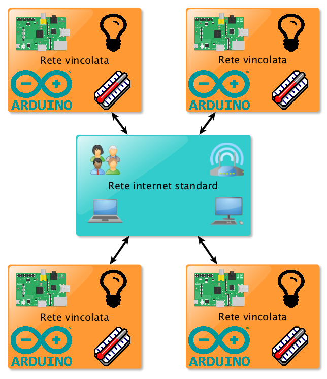
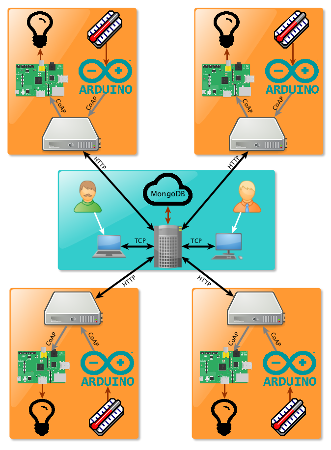
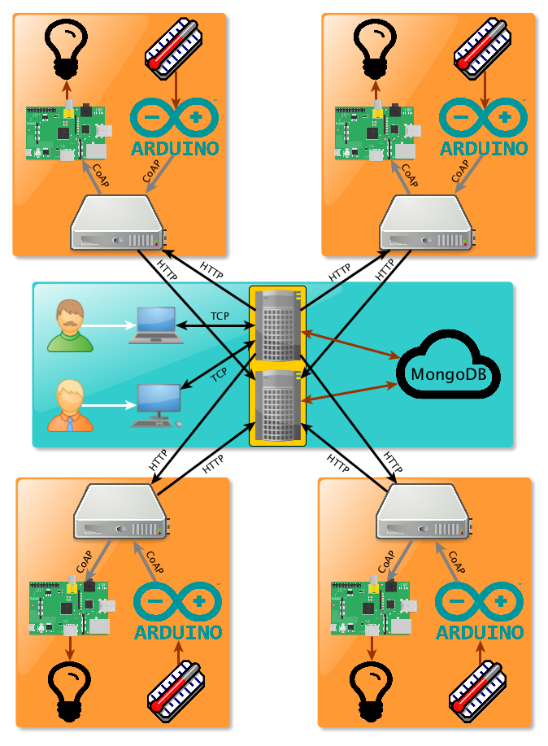
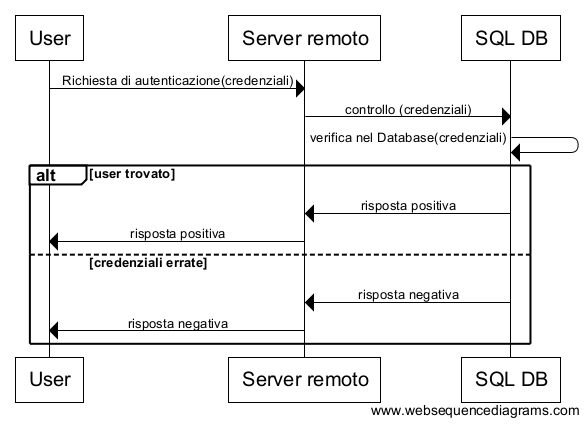
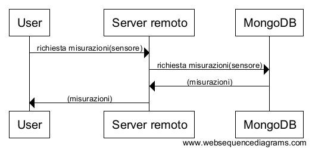
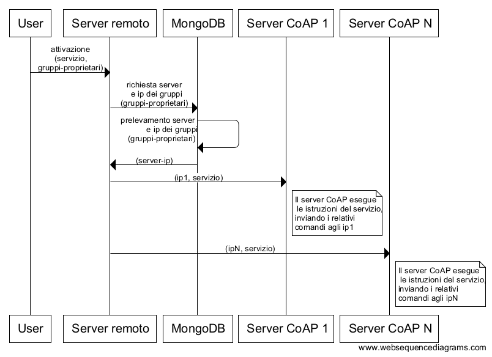
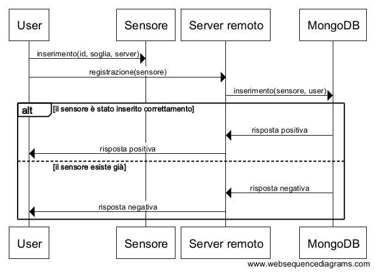
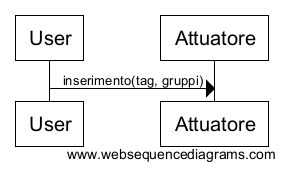
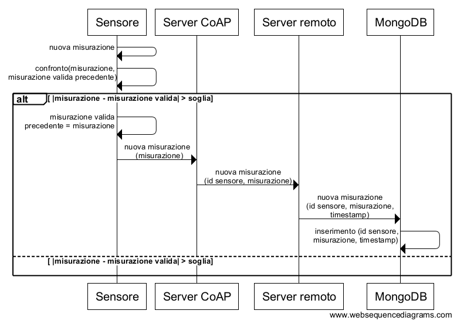

== Il sistema sviluppato
Dopo aver visto le basi teoriche delle tecnologie su cui si fonda il progetto, si illustra di seguito il sistema sviluppato, ponendo particolare attenzione allo scenario di riferimento, ai vincoli che esso impone, agli obiettivi del progetto, alla soluzione, ai requisiti, alle funzionalità e ad alcuni casi d'uso.

=== Scenario di riferimento
Lo scenario di riferimento è quello di un insieme di reti vincolate, contenenti i dispositivi, che si interfacciano con la rete internet standard e gli utenti 
che vogliono accedere ai dispositivi, come mostrato nella figura di seguito.

[[img-scenario1]]
.Rappresentazione dello scenario

I dispositivi:: Sono sensori e attuatori collegati a un sistema embedded, che gli permette di comunicare con il mondo esterno. Si considerano tutti come dei nodi vincolati.

Le reti vincolate:: Sono rappresentate da qualunque ambiente in cui vi siano dei nodi vincolati. +
Come si è visto nella sezione 1.1.1, infatti, l’uso dei nodi vincolati spesso porta anche a vincoli sulle reti stesse, quindi, anche se una rete non ha vincoli, ma al suo interno contiene nodi vincolati, essa può essere considerata ugualmente come una rete vincolata. +
Alcuni esempi potrebbero essere:
* smart home con le luci che si accendono in base all'ora del giorno e alla locazione dell'interruttore attivato
* università in cui si registrano gli ingressi e le uscite degli studenti dai laboratori e le cui porte si aprono solo se gli studenti sono abilitati a passare
* terreni agricoli con dei sensori che misurano la presenza di determinati insetticidi.

Gli utenti:: Persone che, mediante un client, vogliono accedere ai dispositivi attraverso la rete Internet o una rete intranet.

==== Vincoli progettuali
Visto lo scenario di riferimento, è possibile elencare i vari vincoli progettuali che esso impone:

* la presenza di nodi vincolati, per tutte le problematiche descritte nel capitolo 1.1.1, impone l'utilizzo del protocollo CoAP, poiché quest'ultimo ottimizza l'utilizzo di questi tipi di dispositivi
* la presenza di più utenti che vogliono personalizzare il servizio, registrando i propri dispositivi o i propri servizi, porta all'esigenza di salvare le credenziali di accesso per ogni utente
* Il vincolo precedente implica l'impiego di una comunicazione sicura, in quanto non è possibile far viaggiare su internet i dati personali degli utenti in chiaro. Inoltre non tutti gli utenti vogliono condividere le informazioni riguardanti i propri dispositivi, quindi deve essere possibile criptare anche queste ultime

=== Obiettivi
Il progetto nasce per realizzare un sistema che permetta agli utenti di comandare gli attuatori mediante regole e servizi specificati da loro stessi 
e di leggere le misurazioni prodotte dai sensori.
Tali obiettivi si traducono nei seguenti obiettivi tecnologici:

* utillizare CoAP come protocollo di comunicazione nelle reti vincolate;
* gestire l'aggregazione di più attuatori all'interno di gruppi multicast;
* far accedere gli utenti ai dispositivi mediante il protocollo HTTP;
* salvare i dati dell'applicazione all'interno di un database NoSQL, mantenendo i dati personali degli utenti in un database SQL;
* gestire la creazione di gruppi di utenti e dispositivi.

=== La soluzione

==== Schema
S'illustra di seguito lo schema completo della soluzione sviluppata, spiegando quali sono stati i componenti che a mano a mano sono stati aggiunti e per quale motivo.

===== Schema iniziale
Il primo elemento che si è pensato di aggiungere allo scenario è un server remoto che salvasse tutti i dati che servono all'applicazione, le misurazioni effettuate dai sensori e che fasse gestire il controllo degli attuatori in modo semplificato. Gli utenti, dunque, possono leggere le misurazioni dei sensori e controllare gli attuatori mediante un'interfaccia offerta da questo server.

I sensori e gli attuatori, tuttavia, non possono interfacciarsi direttamente con il server remoto, in quanto è necessaria un'altra entità che gestisca ogni rete vincolata. Si è scelto, dunque, di aggiungere in ogni rete vincolata un server di frontiera, che per semplicità chiameremo "server CoAP". Il nome deriva dal fatto che questo server comunica mediante il protocollo CoAP con i dispositivi della rete vincolata, in modo da limitare gli effetti dei vincoli.

Lo schema della soluzione sviluppata, dunque, prevede che i dispositivi comunichino con il server CoAP della propria rete vincolata e che quest'ultimo comunichi con il server remoto in modo tale da mandare le misure dei sensori e fornire un'interfaccia per comandare i gruppi multicast di attuatori presenti nella propria sottorete.

[[img-soluzione1]]
.Schema della prima soluzione sviluppata

===== Schema completo
Lo schema appena illustrato ha il problema che il server remoto è troppo sovraccarico, in quanto deve ricevere sia le richieste dei server CoAP che quelle degli
utenti.

Si è pensato dunque di creare due server distinti e indipendenti: uno che ricevesse le richieste degli utenti e gestisse le richieste in uscita verso i server
CoAP e uno che, invece, ricevesse le richieste in entrata da questi ultimi. Facendo così, se si hanno a disposizione due macchine, ogni server può girare su una
macchina diversa, consentendo di avere un bilanciamento del carico di lavoro. 

Questa organizzazione logica separa la necessità degli utenti di controllare gli attuatori e, quindi, di far partire richieste verso i server CoAP
dalla gestione dei dati mandati dai sensori che vanno opportunamente processati ed immagazzinati, cioè le richieste in entrata dei server CoAP.

Lo schema completo del sistema, dunque, è il seguente.

[[img-soluzione2]]
.Schema della soluzione sviluppata

Come si può notare non ci sono frecce tra i due server perché non hanno bisogno di comunicare tra di loro, in quanto sono stati progettati in modo da essere indipendenti l'uno dall'altro, per evitare di aumentare la latenza del sistema. In ogni caso da un punto di vista logico il server viene considerato unico e sempre sotto il nome di "server remoto".

==== Gestione della sicurezza
Per gestire la sicurezza vengono usati gli algoritmi di crittografia RSA e AES. Le chiavi dell'algoritmo RSA possono essere a 1024 o a 2048 bit, mentre quelle dell'AES possono essere a 128 oppure, scaricando la Java Cryptography Extension (JCE), a 256 bit.

Il server espone la chiave pubblica RSA a tutti, infatti, dal client viene richiesta automaticamente quando se ne ha la necessità, come ad esempio quando bisogna registrarsi al sistema. L'amministratore del server può decidere in qualsiasi momento di cambiare la chiave pubblica, in quanto vi sono meccanismi, spiegati meglio nel capitolo successivo, che permettono di rilevare quando un client ha bloccato la chiave, ovvero quando la sta usando per mandare dei dati al server; quindi la chiave pubblica verrà cambiata solo quando tutti client avranno finito di eseguire le loro operazioni o quando la sessione con tutti i client sarà scaduta, escludendo così il pericolo che server e client utilizzino contemporaneamente chiavi diverse.

Se non esiste alcuna coppia di chiavi RSA, essa viene creata all'avvio, sia nel server sia nel client. La chiave AES, invece, è creata dal server al momento della registrazione dell'utente e viene inviata al client al momento del login criptandola con la sua chiave pubblica, in modo tale che solo il client, con la sua chiave privata, potrà decriptarla.
Siccome il client è stato realizzato con lo scopo di far connettere l'utente da quanti client volesse (non contemporaneamente) al momento del login se non è presente la chiave AES, ad esempio perché ci si sta connettendo per la prima volta da un client diverso da quello con cui ci si è registrati, essa viene richiesta e, se il login avviene con successo, il server manda la chiave, criptandola con la chiave pubblica del nuovo client, che viene mandata da quest'ultimo al momento del login.

Con questo sistema l'unico inconveniente è che non si può cambiare la chiave AES, perché il client ogni volta che trova una chiave AES nel suo file system riguardante quel determinato utente assume che sia corretta e la utilizza. Per fare in modo che si potesse cambiare la chiave AES si potevano scegliere altre due strade:

* il server tiene traccia di tutti i client dai quali l'utente si era collegato, notificandoli se la chiave AES era stata modificata;
* il server manda a ogni nuova sessione la chiave AES e non la cambia fin quando la sessione non è conclusa, a meno di mettersi d'accordo con il client.

Questi due metodi sono abbastanza dispendiosi in termini di risorse, perché aggiungono complessità all'operazione di login, che è l'operazione che si esegue con più frequenza, quindi si è preferito scegliere la soluzione di non poter cambiare la password AES.

Le operazioni legate all'utente in se, quindi login, logout, eliminazione dell'account e registrazione, sono effettuate con l'algoritmo RSA, mentre tutte le altre operazioni, come l'inserimento di un nuovo dispositivo, la ricezione di misurazioni, eccetera, vengono criptate con la chiave simmetrica AES.

==== Gerarchia dei gruppi
Una caratteristica fondamentale del sistema è l'organizzazione in gerarchie dei gruppi di utenti e dispositivi.

===== Gerarchia dei gruppi di utenti
La gerarchia dei gruppi di utenti si traduce in un'ereditarietà dei privilegi rispetto al gruppo padre.
Questo significa che un gruppo figlio ha tutti i privilegi del gruppo padre, ma può anche aggiungerne di nuovi.
Quando questo avviene, i nuovi privilegi saranno trasmessi anche ai suoi discendenti, ma non ai suoi antenati.

Un esempio potrebbe essere quello di un'università in cui si ha un gruppo di studenti che sono abilitati ad aprire le porte che conducono alle aule.
Se da questo gruppo viene creato un sottogruppo di tirocinanti che, oltre a seguire le lezioni di mattina, nel pomeriggio deve recarsi presso alcuni laboratori, gli utenti appartenenti al gruppo di tirocinanti saranno già abilitati ad aprire le porte che conducono alle aule e basterà aggiungere solo i permessi che i tirocinanti hanno in più rispetto agli studenti normali per completare la registrazione del nuovo gruppo, quindi non bisognerà riscrivere ogni volta, per ogni gruppo, dei permessi che sono già stati descritti per altri gruppi.

Se si vuole far appartenere il dispositivo a più gruppi di utenti che non appartengono alla stessa gerarchia, è possibile specificare più gruppi per utente.

===== Gerarchia dei gruppi di dispositivi
Grazie all'organizzazione di tipo gerarchica, risulta molto più semplice accedere ai dispositivi per gli utenti. Accedendo a un gruppo, infatti, verranno selezionati sia i dispositivi che appartengono a quel gruppo sia quelli che appartengono ai gruppi figli. Specificando la gerarchia, dunque, si potrà ottenere la condizione più semplice da gestire, ovvero quella in cui un dispositivo può appartenere solamente ad un gruppo, senza rinunciare alla possibilità di accedere a un dispositivo da più gruppi.

Se non ci fosse il meccanismo di gerarchia, dunque, se si volesse far appartenere un dispositivo a più gruppi, si dovrebbe aggiungere quel dispositivo a tutti questi gruppi mentre, se i gruppi in questione sono tutti legati da un rapporto di discendenza, basterà aggiungere il dispositivo nell'ultimo discendente.

Un esempio di gerarchia per i gruppi di dispositivi potrebbe essere quella di un palazzo in cui vi è una lampadina all'interno di una stanza e si vuole accedere a questa lampadina sia quando si vogliono controllare tutti dispositivi del palazzo, sia quelli del piano dove si trova la stanza, sia quelli della stanza. In questo caso basterà creare un gruppo relativo al palazzo, un gruppo relativo al piano e un gruppo relativo alla stanza, estendendoli nell'ordine in cui sono stati elencati. In questo modo, quando si accederà al gruppo del palazzo, tutti i dispositivi che sono in un gruppo in cui vi è come antenato il gruppo del palazzo e i dispositivi che appartengono al gruppo del palazzo verranno coinvolti nel servizio, inclusa la lampadina interessata.
Allo stesso modo, la lampadina sarà coinvolta quando si accederà sia al gruppo del piano sia a quello della stanza.

In ogni caso, se si volesse far appartenere il dispositivo a gruppi diversi che non sono legati tra di loro da rapporti di discendenza, ad esempio perché lo si vuole aggiungere a gruppi di altri utenti, è comunque possibile specificare più gruppi di appartenenza per dispositivo.

==== Gestione dei tag

All'interno del sistema si è pensato di introdurre un concetto utilizzato recentemente, ad esempio nei social network, che consente di ottimizzare la ricerca
di servizi ed informazioni, ovvero i tag.
Mediante questo strumento, gli utenti possono etichettare qualsiasi dispositivo di loro proprietà, in modo tale da associarlo a un concetto particolare
(es., un'attività, una funzionalità, una posizione,...).
Il sistema, dunque, permette di eseguire l'accesso ai dispositivi mediante queste parole chiave.

Durante lo sviluppo, tuttavia, una delle questioni che ha dato più da pensare è stata l'utilizzo simile che si fa di tag e gruppi. La funzione principale di entrambi gli elementi, infatti, è quella di permettere l'accesso a più dispositivi contemporaneamente sotto un unico nome logico, quindi si è pensato alle possibilità di unire questi due concetti o di lasciali separati.

La prima opzione consiste nel far coincidere i tag con i gruppi. Questi ultimi, dunque, sono creati mediante i tag che, a questo punto, rappresentano semplicemente i nomi dei gruppi. Nello specifico, nel momento in cui si aggiunge un tag a un dispositivo, per gli attuatori significa mettersi in ascolto all'indirizzo IP multicast del gruppo il cui nome corrisponde al tag, mentre per i sensori significa aggiungere il gruppo, il cui nome corrisponde al tag, nel documento di quel sensore nel database MongoDB.

Questo approccio ha sia lati positivi che lati negativi:

Pro::
* riduzione della complessità del progetto, in quanto tag e gruppi vengono gestiti come un'unica entità e non come due separate
* quando si fa un accesso mediante tag a degli attuatori, si sa già a quali dispositivi mandare la richiesta in quanto, poiché un tag ha una corrispondenza 1 a 1 con un indirizzo IP multicast, non c'è bisogno di cercare quali attuatori hanno quel determinato tag, dunque si riduce la latenza.

Contro::
* se vi sono molti tag, un attuatore deve associarsi a molti indirizzi multicast perché ogni tag, di fatto, corrisponde a un gruppo
* snaturamento del concetto di tag per evitare la perdita del sistema di gerarchie dei gruppi

La seconda possibilità è mantenere i tag e i gruppi separati, quindi specificare, per ogni dispositivo, sia i gruppi di cui fa parte sia i tag che gli sono stati assegnati. In questo caso, per accedere ai sensori mediante i tag, basterà fare una query su MongoDB per trovare tutti i sensori che contengono quel determinato tag, mentre per gli attuatori bisogna mandare il messaggio a tutti i gruppi multicast interessati. Una volta ricevuto il messaggio, se nel payload è specificato un tag, ogni attuatore controllerà se possiede quel tag e solo in caso affermativo il dispositivo eseguirà l'istruzione ricevuta.

Un tag all'interno di un attuatore con questo approccio, dunque, non si riferisce più a un gruppo, ma rappresenta un'etichetta che gli utenti danno per classificare i loro dispositivi.

Pro::
* utilizzo dei tag più classico
* l'utente può creare quanti tag desidera senza inficiare sulle prestazioni del singolo attuatore, in quanto quest'ultimo sta in ascolto solamente dei gruppi

Contro::
* ricerca dei tag piuttosto onerosa negli attuatori se va fatta su molti dispositivi, perché il messaggio deve essere mandato a tutti i gruppi su cui si desidera effettuare la ricerca del tag, quindi tutti i dispositivi riceveranno il messaggio per controllare se possiedono il tag o meno
* gli utenti devono gestire sia i tag sia i gruppi, perché questi non sono più collegati, il che implica una maggiore complessità del sistema, sia a livello concettuale che a livello progettuale

Tra i contro del primo approccio e i pro del secondo ve ne sono due che non sono stati commentati volutamente, perché rappresentano gli aspetti che, più di tutti, hanno fatto scegliere di adottare nel progetto la seconda opzione, dunque necessitano di un discorso più approfondito, che si affronterà qui di seguito.

Il pro a cui si fa riferimento è l'utilizzo dei tag più classico, mentre il contro è lo snaturamento del concetto di tag per evitare la perdita del sistema di gerarchie dei gruppi. Nei vari social network non si è mai visto che i tag fossero organizzati in maniera gerarchica, perché sarebbe molto complicato da gestire per l'utenza media. In questo progetto, tuttavia, la gerarchia dei gruppi, sia di dispositivi sia di utenti, è presente tra i requisiti, quindi non è qualcosa alla quale si può rinunciare e, se si vuole unire il concetto di tag a quello di gruppo, è inevitabile che si debba introdurre una gerarchia per i tag. Siccome l'utenza è abituata a usare i tag nella sua quotidianità ed ha ben chiaro in mente cosa rappresentano, si è ritenuto che pensare i tag in maniera gerarchica risulti più complicato di mantenere separati i concetti di tag e gruppi per l'utente medio, quindi si è deciso di adottare la seconda opzione.

In definitiva, i gruppi devono essere usati per tutti gli accessi che si fanno più frequentemente, mentre i tag per operazioni che si fanno molto raramente, in modo da non sovraccaricare il sistema durante le operazioni più frequenti (cosa che accade nel primo approccio, in quanto ogni attuatore sta in ascolto su tutti i tag) senza perdere la possibilità di attivare servizi particolari mediante i tag quando se ne ha la necessità.

In ogni caso per selezionare i gruppi in maniera smart, vi sono anche i tag per gruppi, chiamati "group tags", che consentono di selezionare tutti i gruppi che hanno dei determinati tag.

=== Requisiti

La soluzione sviluppata prevede che ciascun componente del sistema risponda a determinati requisiti.

==== Utente
L'utente deve potere eseguire le seguenti operazioni:

Gestione gruppi di utenti::
* creare gruppi di utenti
* aggiungere altri utenti ai propri gruppi di utenti
* rimuovere altri utenti dai propri gruppi di utenti
* verificare a quali gruppi di utenti si appartiene
* verificare quali altri utenti appartengono a un gruppo a cui si appartiene
* uscire da un gruppo di utenti
* avere accesso a tutti i dispositivi che sono accessibili a tutti i gruppi di utenti ai quali si fa parte
* organizzare i propri gruppi di utenti con una gerarchia

Gestione della sicurezza dei dispositivi::
* rendere un proprio dispositivo *privato*: il dispositivo può essere aggiunto solo ai gruppi di dispositivi di possesso del proprietario del dispositivo e inoltre solo quest’ultimo può accedervi
* rendere un proprio dispositivo ristretto solo ad alcuni gruppi di utenti: l’utente specifica quali gruppi di utenti possono accedere al proprio dispositivo
* rendere un proprio dispositivo ristretto solo ad alcuni gruppi di dispositivi: l’utente specifica a quali gruppi di dispositivi può essere aggiunto il proprio dispositivo
* rendere un proprio dispositivo ristretto solo ad alcuni gruppi di utenti e di dispositivi
* rendere un proprio dispositivo *pubblico*: il dispositivo può essere aggiunto a qualsiasi gruppo di dispositivi e, inoltre, qualsiasi utente può accedere a quel dispositivo

Gestione della sicurezza generale::
*	Scambiare dati con il server remoto in maniera sicura e affidabile

Gestione dispositivi::
* registrare i propri dispositivi online
* creare gruppi di dispositivi
*	aggiungere a un gruppo di cui si è il proprietario altri dispositivi di proprietà, pubblici o che hanno quel gruppo tra i gruppi ristretti
* creare dei servizi personalizzati, installarli sui propri server e usarli in modo agevole
* aggiungere e rimuovere tag ai propri dispositivi
* accedere ai dispositivi mediante filtri come marca, tag, posizione e nome
* organizzare i propri gruppi di dispositivi con una gerarchia

Gestione del proprio account::
* registrarsi al servizio specificando username, password ed email
* eseguire il login mediante username e password
* eseguire il logout
* eliminare il proprio account

==== Server remoto
Il server remoto deve implementare le seguenti funzionalità:

* salvare i dispositivi che vengono registrati dagli utenti;
* scambiare dati in maniera sicura e affidabile con l'utente e i server CoAP
* fornire dei mezzi per facilitare la creazione, l'installazione e l'utilizzo dei servizi personalizzati
* funzionare da "ponte" tra utenti e server CoAP
* non deve salvare informazioni personali nel cloud

==== Server CoAP
Il server CoAP deve implementare le seguenti funzionalità:

* installare ed utilizzare i servizi;
* funzionare da "ponte" tra server remoto e dispositivi, mandando al server remoto le misurazioni dei sensori e mandando agli attuatori le richieste che provengono dal server remoto.
* deve comunicare con il server remoto mediante HTTP e con i dispositivi con il protocollo CoAP
* attivare i gruppi di attuatori in base alla locazione dell'interruttore attivato e all'orario, con regole stabilite dall'utente

==== Dispositivi
Tutti i dispositivi::

* Devono poter comunicare mediante il protocollo CoAP

Sensori::

*	Nei sensori deve esserci la possibilità di impostare una soglia che stabilisca se la misurazione effettuata è significativa o meno.

Attuatori::

*	Devono potersi collegare a gruppi multicast

=== Funzionalità

Oltre alle varie funzionalità descritte precedentemente, ve ne sono alcune più specifiche che sono spiegate qui di seguito.

==== Soglia dei sensori
Per quanto riguarda i sensori si è pensato di introdurre una soglia, che stabilisce se la misura effettuata ha necessità di essere notificata al server oppure no. Ad esempio, per un sensore di temperatura nella maggior parte dei casi ha poco senso specificare che la temperatura è cambiata di 0,04 °C, quindi l'utente per evitare di intasare la propria sottorete e di salvare misure inutili, potrebbe impostare 0,1 come soglia per quel sensore, in modo tale da apprezzare solamente cambiamenti significativi della grandezza che si sta misurando, in quanto il sensore manderà una nuova misurazione solo se questa si discosterà di un valore superiore di 0,1 dalla misura inviata precedentemente.

Ogni volta che un sensore effettua una nuova misurazione, dunque, la confronta con quella precedente. Se la misurazione differirà da quella precedente di un valore superiore in valore assoluto alla soglia, allora la misurazione verrà ritenuta valida, quindi verrà mandata al server CoAP e sostituita con quella precedente per i futuri confronti.

==== Servizi personalizzati
Nel server CoAP è stato realizzato un database mysql, che registra le corrispondenze tra gruppi di attuatori, orari e le locazioni, in modo tale che se un interruttore di una determinata locazione viene attivato a una certa ora del giorno si attivavano o si disattivavano solo determinati gruppi.

Questa, tuttavia, è solo una delle svariate possibili funzioni che può avere questo sistema e si è pensato che in alcune situazioni potrebbe essere l'utente stesso a volerle sviluppare. Per questo motivo è stata data la possibilità di creare i servizi per i server CoAP al possessore del server stesso.

Nello specifico nel server CoAP viene creata una cartella nominata con il nome del servizio, all'interno della quale deve obbligatoriamente essere presente un programma nominato “main.py”, che è il programma che viene lanciato quando viene attivato il servizio. Oltre a questo possono essere presenti tutti gli altri file che sono necessari al servizio stesso, come ad esempio altri script python o i dati di cui ha bisogno il programma.

Il programma viene lanciato da remoto, mediante una POST (CoAP o HTTP), indicando nel payload il nome del servizio e i parametri che si vogliono passare ad esso. Questi ultimi verranno interpretati come parametri della linea di comando, quindi se il contenuto del payload è: “service1 parametro1 parametro2” nel coap server verrà lanciato il comando “main.py parametro1 parametro2”, dove main.py è contenuto nella cartella service1.

Registrare un nuovo servizio è semplicissimo, infatti basterà selezionare, mediante un'interfaccia grafica user friendly, la cartella nominata come il servizio, contenente tutti i file di cui esso necessita, compreso il file “main.py”, e indicare a quali server di propria proprietà si vuole inviare il servizio. Il client comprimerà la cartella e la invierà al server remoto, che si occuperà di smistare il contenuto del file zip ai vari server CoAP.

In fase di registrazione del servizio viene chiesto se lo si vuole rendere pubblico, ristretto solo ad alcuni gruppi di utenti o privato, ovvero accessibile solo dal proprietario del server.
Se si vuole che il servizio sia disponibile anche a dispositivi non dotati di autenticazione (ad esempio un interruttore comune), bisogna impostare il servizio come pubblico.

L'esempio fatto precedentemente sul contenuto del payload e dei parametri della linea di comando è inesatto in quanto, per semplicità, si è omesso un parametro che deve essere sempre presente, ovvero quello chiamato “actuators_groups”. Mediante questo parametro bisogna specificare la lista di gruppi di attuatori su cui si vuole attivare il servizio, specificandone il nome e l'utente che li possiede (se non è specificato si sottindende che siano di proprietà dell'utente che sta usando il servizio).

Il server remoto si occuperà di trovare gli ip dei gruppi di attuatori tra i gruppi degli utenti indicati e gli ip trovati verranno sostituiti ai nomi dei gruppi all'interno del parametro “actuators_groups”. Esso, inoltre, manderà la richiesta di servizio a tutti i server che contengono almeno uno dei gruppi di attuatori indicati. Il programma “main.py” del servizio specifico, dunque, sarà richiamato solo sui server che contengono almeno uno dei gruppi di attuatori indicati. Questi server, come parametri di linea di comando, si ritroveranno gli stessi parametri che chi ha richiesto il servizio ha mandato al server remoto, con la differenza che ora “actuators_groups” conterrà una lista degli indirizzi ip presenti nella sottorete di quel server, invece che i loro nomi. Ovviamente il server remoto, prima di distribuire le richieste di servizio ai vari server CoAP, farà le dovute verifiche per verificare che l'utente che richiede il servizio è abilitato a essere servito.

Un altro parametro speciale che viene fornito al servizio è quello dei tag, in quanto l'utente può attivare un servizio personalizzato solo sugli attuatori che hanno dei determinati tag. I tag inseriti dall'utente, dunque, verranno concatenati con delle virgole e si troveranno dopo la dicitura "tags:_" dopo gli ip dei gruppi di attuatori e prima degli altri parametri inseriti dall'utente. 

Per fornire un esempio di come utilizzare i servizi, il comportamento degli orari e delle locazioni di prima viene trattato come se fosse un servizio, chiamato “green_activator” anche se, in realtà, per questioni di ottimizzazione, è impostato diversamente rispetto altri servizi.

A partire da questo esempio, dunque, potremmo introdurre una categoria di "servizi admin", che hanno le seguenti caratteristiche:

* possono essere aggiunti solamente dal codice sorgente del progetto stesso, quindi si possono fare delle operazioni di ottimizzazione
* il modo in cui li si usa non deve essere diverso da quello dei servizi normali
* se esiste un servizio utente nominato come il servizio admin, quando l'utente richiede il servizio con quel nome, viene attivato solo il servizio admin

L'obiettivo, dunque, è quello di fornire alcuni servizi base di uso comune mediante i servizi admin e di lasciare la possibilità di sviluppare servizi personalizzati in base alle esigenze dell'utente mediante i servizi normali, che d'ora in poi verranno chiamati "servizi utente".

=== Casi d'uso

==== Login
. L'utente richiede di autenticarsi inviando username e password
. Il server invia le credenziali al database SQL
. Il database SQL controlla se le credenziali corrispondono a un utente registrato al database e, se questo è vero, manda una risposta positiva
. Il server manda una risposta positiva all'utente, che ora risulta autenticato

[[img-login]]
.Sequence diagram del login

==== Leggere le misurazioni del sensore
Condizioni iniziali: l'utente ha già effettuato il login.

. L’utente manda al server il nome del sensore di cui vuole sapere le misurazioni
. il server legge le misurazioni nel database e le manda all'utente

[[img-misurazioni]]
.Sequence diagram della richiesta delle misurazioni

==== Attivare un servizio su un gruppo di attuatori
Condizioni iniziali: l'utente ha già effettuato il login.

. L'utente manda al server remoto quale servizio vuole attivare, su quale gruppo di attuatori vuole attivarlo, specificando anche i corrispettivi proprietari dei gruppi, nel caso in cui essi non fossero di sua appartenenza
. Il server remoto chiede al database a quali server CoAP appartengono i gruppi di attuatori che si vuole controllare e gli IP dei gruppi di attuatori
. Il server invia ad ogni server CoAP trovato il nome del servizio e gli IP dei gruppi di attuatori presenti nella sua sottorete su cui attivare il servizio
. Ogni server CoAP esegue le istruzioni del servizio, inviando i relativi comandi agli ip specificati dal server remoto.

[[img-servizi]]
.Sequence diagram dell'attivazione dei servizi

==== Inserimento di un nuovo sensore
Condizioni iniziali: l'utente ha già effettuato il login.

. L'utente inserisce nel sensore il suo id, la sua soglia e specifica il server CoAP al quale vuole inviare i dati;
. L'utente registra il sensore nel server remoto, specificando tutte le sue caratteristiche.
. Il server remoto controlla se non è già stato registrato un sensore con lo stesso nome da parte dello stesso utente e, nel caso in cui il nome sia disponibile, da una risposta positiva al client

.Sequence diagram dell'inserimento di un nuovo sensore

==== Inserimento di un nuovo attuatore
Condizioni iniziali: l'utente ha già effettuato il login.

. L'utente inserisce nell'attuatore i suoi tag e i gruppi multicast al quale l'attuatore appartiene

.Sequence diagram dell'inserimento di un nuovo attuatore

Si noti che il server remoto non tiene traccia dei singoli attuatori in quanto il multicast ci permette di creare una astrazione e di trattarli, insieme, come gruppi.

==== Inserimento di una misurazione
Condizioni iniziali: l'utente ha già effettuato il login.

. Il sensore effettua una misurazione
. Il sensore confronta la misurazione effettuata con la misurazione valida precedente e se questa differisce da quest'ultima di un valore superiore in valore assoluto alla soglia, allora la misurazione verrà ritenuta valida
. Se la misurazione è ritenuta valida, il sensore la manda al server CoAP e la sostituisce alla misurazione valida precedente per i futuri confronti
. Il server CoAP manda la misurazione al server remoto, indicando anche l'id del sensore che l'ha effettuata
. Il server remoto salva la misurazione ricevuta, insieme all'id del sensore e a un timestamp.

.Sequence diagram dell'inserimento di una nuova misura

