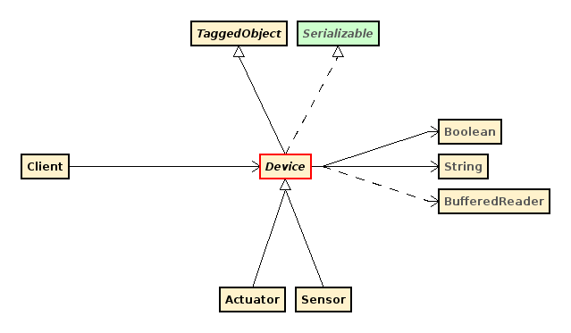

== Dettagli implementativi

Dopo aver spiegato il funzionamento del sistema nel capitolo precedente, si illustrano di seguito i dettagli implementativi.

=== Linguaggi di Programmazione
E' stato utilizzato java nella versione 8 per le parti che riguardano il client, il server remoto e MongoDB (in quanto, per interfacciarsi con quest'ultimo, è stato utilizzato il driver java), mentre per il CoAP server, gli interruttori, i sensori e gli attuatori è stato utilizzato python 2.7.

La scelta della versione di python è stata forzata, in quanto il CoAPthon è basato su di essa.

Come regole di indentazione del codice si sono seguiti gli standard di default di eclipse mars, ovvero 120 caratteri massimi per riga per il codice e 80 per i commenti.

=== Gruppi

==== Gestione della gerarchia

Tra i vari metodi elencati nella documentazione di MongoDB per gestire gli alberi, si è scelto la struttura con materialized paths. Con questa struttura ogni nodo dell'albero viene salvato in un documento e, nello stesso documento, viene salvato il suo percorso all'interno dell'albero, ovvero gli id degli altri nodi genitori in modo ordinato.

Esempio:

[source,json]
----
{ _id: "gruppo1", path: null }
{ _id: "gruppo2", path: ",gruppo1," }
{ _id: "gruppo3", path: ",gruppo1,gruppo2," }
{ _id: "gruppo4", path: ",gruppo1,gruppo2," }
{ _id: "gruppo5", path: ",gruppo1,gruppo2,gruppo3," }
{ _id: "gruppo6", path: ",gruppo1,gruppo2,gruppo3," }
----

Questi documenti rappresentano la seguente struttura:

.Esempio di gerarchia dei gruppi
image::images/esempio_gerarchia.png[Esempio di gerarchia dei gruppi, align="center"]

Si è scelta questa struttura per caratterizzare tutte le collection dei gruppi del progetto perché consente di avere la struttura ad albero con cui si è scelto di organizzare i gruppi per instaurare una gerarchia tra di essi già salvata all’interno del documento.

Un'altra possibilità che è stata presa in considerazione è quella della referenza al padre in cui, per ogni nodo dell'albero, viene salvato solamente il suo nodo genitore piuttosto che tutto il suo percorso fino al nodo root. Questo sistema permette di risparmiare in termini di spazio occupato, ma va ad inficiare negativamente sulla complessità computazionale in modo non indifferente. Per gestire query come “trovare tutti i figli di un certo nodo” e non fare troppi accessi su disco per interrogare il DB è necessario creare e mantenere aggiornata una struttura dinamica in memoria, quindi per diminuire sia la complessità computazionale che quella del progetto in se, si è deciso di evitare questa struttura in favore di quella con riferimento al path completo “materializzato” nel DB stesso. Inoltre, creando un indice sul path query come quella descritta precedentemente si risolvono in tempi molto brevi grazie all'indicizzazione di MongoDB, in quanto in ogni documento è scritto ogni predecessore di quel nodo.

Per comprendere meglio questo tipo di struttura si riporta di seguito il codiche della funzione InserGroup, presente all'interno della classe DBManager e tutte le funzioni più importanti che essa richiama. Questa funzione, come si intuisce dal titolo, consente di inserire un gruppo all'interno del database MongoDB.

===== Inserimento di un gruppo
[source,java]
----
public Boolean insertGroup(GenericalGroup gg) {
	Document doc = new Document(DatabaseDefines.GROUP_ADMIN, getUserId(gg.getAdmin())).append(DatabaseDefines.NAME, gg.getName());
	if (gg.isPublic())
		doc.append(DatabaseDefines.IS_PUBLIC, true);
	else
		doc.append(DatabaseDefines.IS_PUBLIC, false);
	if (gg.getDescription() != null) {
		doc.append(DatabaseDefines.GROUP_DESCRIPTION, gg.getDescription());
	}
	if (gg.getTags().size() > 0)
		doc.append(DatabaseDefines.TAGS, gg.getTags());
	try {
		if (gg instanceof SensorsGroup) {
			SensorsGroup sg = (SensorsGroup) gg;
			if (sg.getPath() == null) {
				assignGroupPath(sg, DatabaseDefines.SENSORS_GROUP_COLLECTION);
			}
			doc.append(DatabaseDefines.PATH, sg.getPath());
			if (sg.getSensors() != null)
				doc.append(DatabaseDefines.SENSORS, getSensorsId(sg.getSensors()));
			db.getCollection(DatabaseDefines.SENSORS_GROUP_COLLECTION).insertOne(doc);
		} else if (gg instanceof UsersGroup) {
			UsersGroup ug = (UsersGroup) gg;
			if (ug.getPath() == null) {
				assignGroupPath(ug, DatabaseDefines.USERS_GROUP_COLLECTION);
			}
			doc.append(DatabaseDefines.PATH, ug.getPath());
			if (ug.getUsers() != null)
				doc.append(DatabaseDefines.USERS, ug.getUsers());
			db.getCollection(DatabaseDefines.USERS_GROUP_COLLECTION).insertOne(doc);
		} else {
			ActuatorsGroup ag = (ActuatorsGroup) gg;
			if (ag.getPath() == null) {
				assignGroupPath(ag, DatabaseDefines.ACTUATORS_GROUP_COLLECTION);
			}
			doc.append(DatabaseDefines.PATH, ag.getPath());
			if (ag.getIp() != null) {
				doc.append(DatabaseDefines.ACTUATORS_GROUP_IP, ag.getIp());
				doc.append(DatabaseDefines.SERVER_IP_PORT, ag.getServer().getIpPort());
			}
			db.getCollection(DatabaseDefines.ACTUATORS_GROUP_COLLECTION).insertOne(doc);
		}
	} catch (Exception e) {
		e.printStackTrace();
		return false;
	}
	return true;
}

public void assignGroupPath(GenericalGroup gg, String collection) {
	if (gg.getParentGroupName() == null) {
		gg.setPath(",");
	} else {
		String parentGroupPath = findParentGroupPath(gg, collection);
		if (parentGroupPath == null) {
			System.err.println("parent group does not exists, the group will be saved as root");
			gg.setPath(",");
		} else {
			String path = parentGroupPath + gg.getParentGroupName() + ",";
			gg.setPath(path);
		}
	}
}
----

==== Gruppi di attuatori
Quando si inserisce un gruppo di attuatori vengono chiesti anche l'ip e la porta del server di appartenenza del gruppo, in modo tale che il server remoto sappia come raggiungere il gruppo.

In ogni caso, per un gruppo di attuatori l'IP e il server possono essere NULL perché, in questo caso, si sta esplicitando un gruppo logico, ovvero un gruppo che serve unicamente per avere altri gruppi figli, in modo da richiamarli contemporaneamente quando l'utente si riferisca a questo gruppo logico.

I gruppi, inoltre, possono avere sia IP e server specificati sia avere dei gruppi figli. In tal caso, infatti, la richiesta di servizio verrà inviata sia all'IP del gruppo padre sia all'IP dei gruppi figli.
Per la gestione della sicurezza, nel documento degli actuators group viene salvato il campo “allowed users groups”, in modo tale da specificare i gruppi di utenti che sono abilitati ad accedere a quel gruppo. Questo ovviamente ha effetto solo se il gruppo non è pubblico.

Per far capire meglio questi concetti viene riportata la parte di codice che si occupa di attivare un servizio, da quando viene presa in carico la richiesta da parte del server a quando viene mandata ai server CoAP.

===== Attivazione di un servizio
funzione all'interno di DBManager:

[source,java]
----
public Vector<ActuatorsGroup> getDescendantsActuatorsGroup(ActuatorsGroup group) {
  Document find_conditions = new Document(DatabaseDefines.GROUP_ADMIN, group.getAdmin())
      .append(DatabaseDefines.PATH, Pattern.compile("," + group.getName() + ","));
  Vector<ActuatorsGroup> descendants = new Vector<ActuatorsGroup>();
  MongoCursor<Document> cursor = db.getCollection(DatabaseDefines.ACTUATORS_GROUP_COLLECTION)
      .find(find_conditions).iterator();
  while (cursor.hasNext()) {
    descendants.add(new ActuatorsGroup(cursor.next().toJson().toString()));
  }
  return descendants;
}
----

funzioni all'interno di UserThread:

[source,java]
----
private void activateService() {
	Vector<ActuatorsGroup> actuatorsGroups = (Vector<ActuatorsGroup>) receiveAesDecryptedObject();
	String service = receiveAesDecryptedString();
	String commandLineParameters = receiveAesDecryptedString();
	Vector<ActuatorsGroup> allGroups = getGroupsForService(actuatorsGroups);
	requestService(allGroups, service, commandLineParameters);
}

private Vector<ActuatorsGroup> getGroupsForService(Vector<ActuatorsGroup> actuatorsGroups) {
	Iterator<ActuatorsGroup> it = actuatorsGroups.iterator();
	Vector<ActuatorsGroup> allGroups = new Vector<ActuatorsGroup>();
	Vector<ActuatorsGroup> descendants;
	ActuatorsGroup ag = null;
	while (it.hasNext()) {
		ag = it.next();
		if (!dbm.isUserAllowed(ag, lm.getNickname()))
			continue;
		ag = dbm.getCompleteInformations(ag);
		// I check if the user can access to this actuators group

		allGroups.add(ag);
		descendants = dbm.getDescendantsActuatorsGroup(ag);
		if (descendants.size() > 0) {
			allGroups.addAll(descendants);
		}
	}
	return allGroups;
}

/**
 * it sends an HTTP requests to the servers of the groups to activate the
 * services
 *
 * @param groups
 *            all the groups that you want to get access.
 * @param service
 *            the service that you want to activate
 * @param commandLineParameters
 *            the parameters for the service
 */
public void requestService(Vector<ActuatorsGroup> groups, String service, String commandLineParameters) {
	String server;
	Iterator<ActuatorsGroup> i;
	ActuatorsGroup ag;
	Vector<String> groupsIp = new Vector<String>();
	while (groups.size() > 0) {
		server = groups.get(0).getServer().getIpPort();
		i = groups.iterator();
		while (i.hasNext()) {
			ag = i.next();
			if (ag.getServer().getIpPort().equals(server)) {
				groupsIp.add(ag.getIp());
				i.remove();
			}
		}
		requestServiceToServer(server, groupsIp, service, commandLineParameters);
		groupsIp.removeAllElements();
	}
}

private void requestServiceToServer(String serverIpPort, Vector<String> groupsIpOfTheServer, String service,
    String commandLineParameters) {
  String url = "http://" + serverIpPort + "/basicService";
  List<NameValuePair> urlParameters = new ArrayList<NameValuePair>();

  String groupsIpString = groupsIpOfTheServer.toString().replace("[", "").replace("]", "").replace(" ", "");
  urlParameters.add(new BasicNameValuePair("groupsIps", groupsIpString));
  if (commandLineParameters != null) {
    urlParameters.add(new BasicNameValuePair("service", service));
    urlParameters.add(new BasicNameValuePair("commandLineParameters", commandLineParameters));
  }
  try {
    http.sendPost(url, urlParameters);
  } catch (Exception e) {
    e.printStackTrace();
  }
}
----

Oltre a questa modalità di attivazione sono presenti anche quelle mediante tags e group tags.

==== Gruppi di sensori
Per quanto riguarda i gruppi di sensori, invece, verranno mostrate all'utente solo le misure dei sensori a cui l'utente è abilitato ad accedere. Quando vengono richieste le misure di un gruppo, infatti, il server remoto fornisce solo le misure dei sensori del gruppo a cui l’utente è abilitato ad accedere.

Per chiarire meglio l'accesso ai gruppi di sensori viene riportata la parte di codice che se ne occupa:

===== Lettura di misure di gruppi di sensori
Funzione all'interno di UserThread:

[source,java]
----
private void sendSensorsGroupMeasurements() {
	SensorsGroup group = (SensorsGroup) receiveAesDecryptedObject();
	// I pass the nickname of the user in order to send only the
	// measurements that he is able to see
	sendAesEncryptedObject(dbm.getMeasurements(group, lm.getNickname()));
}
----

funzioni all'interno di DBManager:

[source,java]
----
/**
 *
 * @param group
 * @param username
 * @return the measurements of the group and the measurements of the
 *         descendants of that group, but only those ones that the user is
 *         allowed to see
 *
 */
public Vector<Measurement> getMeasurements(SensorsGroup group, String username) {
	Vector<SensorsGroup> descendants = getDescendantsSensorsGroup(group);
	Vector<Sensor> sensors = getSensors(group);
	Iterator<SensorsGroup> descendantsIt = descendants.iterator();
	SensorsGroup sg;
	while (descendantsIt.hasNext()) {
		sg = descendantsIt.next();
		sg.setAdmin(getNickname(sg.getAdmin()));
		sensors.addAll(getSensors(sg));
	}
	Vector<Measurement> measurements = new Vector<Measurement>();
	Iterator<Sensor> it = sensors.iterator();
	Sensor s;
	while (it.hasNext()) {
		s = it.next();
		s.setOwner(getNickname(s.getOwner()));
		if (isUserAllowedForSensor(s, username))
			measurements.addAll(s.getMeasurements());
	}
	return measurements;
}
----

=== Gestione della privacy e della sicurezza

==== Approccio ibrido SQL e NoSQL
Visto il requisito del server di non poter salvare dati personali nel cloud si è utilizzato un approccio ibrido in cui tutti i dati personali sono salvati in un database SQL insieme all'ID dell'utente, che viene generato dal database stesso, mentre tutti gli altri dati vengono salvati nel database MongoDB, identificando ogni utente solo mediante il suo ID.

In questo modo nel cloud non vi sono username, password, email e altri dati che si potrebbero aggiungere in future versioni del software come nome, cognome, eccetera, ma solamente un ID, la cui corrispondenza con gli altri dati si può trovare unicamente consultando il database relazionale.

==== Accesso ai dispositivi
Nel capitolo precedente abbiamo detto che possono accedere ai vari disposotivi solamente gli utenti abilitati a farlo. A titolo di esempio riportiamo il codice che si occupa di verificare che un utente sia abilitato ad accedere a un sensore.

[source,java]
----
public Boolean isUserAllowedForSensor(Sensor sensor, String username) {
	// try {
	if (isSensorPublic(sensor) || sensor.getOwner().equals(username)) {
		return true;
	} else {
		// I check if one of the Users Group of the user is able
		// to access to the sensor
		Vector<UsersGroup> userGroups = getUsersGroups(username);
		Iterator<UsersGroup> it = userGroups.iterator();
		UsersGroup ug;
		while (it.hasNext()) {
			ug = it.next();
			ug.setAdmin(getNickname(ug.getAdmin()));
			if (isUsersGroupAllowedForSensor(sensor, ug)) {
				return true;
			}
		}
	}
	return false;
}

private Boolean isUsersGroupAllowedForSensor(Sensor sensor, UsersGroup ug) {
	return isUsersGroupAllowedForSensor(sensor.getName(), sensor.getOwner(), ug.getName(), ug.getAdmin());
}

public Boolean isUsersGroupAllowedForSensor(String sensorName, String owner, String groupName, String groupAdmin) {
	return isGroupAllowedForSensor(sensorName, owner, getUsersGroupId(groupName, groupAdmin),
			DatabaseDefines.ALLOWED_USERS_GROUPS);
}

private Boolean isGroupAllowedForSensor(String sensorName, String owner, ObjectId groupId, String field) {
  MongoCursor<Document> cursor = db.getCollection(DatabaseDefines.SENSORS_COLLECTION)
      .find(and(eq(DatabaseDefines.NAME, sensorName), eq(DatabaseDefines.OWNER, getUserId(owner)),
          eq(field, groupId)))
      .iterator();
  return cursor.hasNext();
}
----

==== Gestione delle chiavi
Per gestire al meglio le chiavi sono stati seguiti i seguenti accorgimenti:

* Dopo che si registra, l'utente crea una cartella, chiamata come il suo username, che contiene la chiave pubblica e privata RSA dell'utente e la chiave simmetrica AES. La chiave pubblica RSA del server non è in questa cartella ma è nella cartella superiore a questa, ovvero quella in cui sono contenute le varie cartelle degli username. Questo perché la chiave pubblica rsa del server è comune a tutti gli utenti.
* E' stata creata la classe KeysManager, che serve a gestire chiavi AES e RSA. Le chiavi vengono scritte e lette sui file, però quando viene fatta una operazione di questo tipo la chiave viene aggiunta al dizionario delle chiavi, una struttura dati che risiede in memoria e che, quindi, offre dei tempi di lettura più brevi di quelli del disco fisso creando, così, un meccanismo di caching, che evita di fare una lettura a file tutte le volte che serve una determinata chiave.
* Nel server, la chiave AES di ogni utente viene salvata nel database SQL come Blob, criptandola con la chiave pubblica RSA del server, in modo tale che possa essere decriptata solo con la chiave privata del server.
* Il server non salva la chiave pubblica del client, in quanto la utilizza solamente quando deve mandare la chiave simmetrica Aes al client e, siccome si assume che questa operazione avviene poche volte, è uno spreco di memoria salvarla e, dunque, si è preferito preferito mandarla ogni volta che il client richiede la propria chiave simmetrica.

=== Shell
Si riportano di seguito i menu che vengono presentati rispettivamente al client e all'amministratore del server, che fungono anche da riassunto delle funzionalità del sistema.

==== Lato client
[source]
----
Enter:
1	Login
2	Sign up
3	Quit
----

===== Login effettuato
[source]
----
Enter:
1	Get Measures
2	Services
3	Sensors
4	My servers
5	Users Groups
6	My Devices Groups
7	Logout
8	Delete Account
9	Quit
----

===== 1 Get Measures
[source]
----
1	Get sensor measurements
2	Get sensors measurements by tags
3	Get sensors group measurements
4	Get sensors groups measurements by tags
5	Get sensors group measurements by position
----

===== 2	Services
[source]
----
1	New service
2	Activate Service
3	Activate service by tags
4	Activate service by group tags
----

===== 3	Sensors
[source]
----
1	Add allowed devices groups
2	Add allowed users groups
3	Add sensor to group
4	Add tag to sensor
5	Delete sensor from sensors group
6	Show my devices
7	Insert new sensor
8	Delete sensor
----

===== 5	Users Groups
[source]
----
1	Add users to my group
2	Add tags to my group
3	Get the groups I belong
4	Get users of a group
5	New users group
6	Delete user from users group
7	Exit from group
8	Get my users groups
----

===== 6	My Devices Groups
[source]
----
1	Add tags to actuators group
2	Add tags to sensors group
3	Add allowed users groups to actuators group
4	New Devices Group
5	Get my sensors group
6	Get my actuators group
----

==== Lato server
[source]
----
Enter:
1	Print Online users
2	Generate a new Key Pair
3	Print Server Key Pair
4	Set key size
5	Brands and Models
6	Quit
7	Sensors and Actuators
8	Users
9	Drop a collection
----

===== 5 Brands and Models

[source]
----
1	Insert a new brand
2	Delete a brand
3	Insert a new model
4	Delete a model
----

===== 7 Sensors and Actuators
[source]
----
1	Print Sensors Collection
2	Print Sensors group Collection
3	Print Actuators group Collection
----

===== 8 Users
[source]
----
1	Print Sensors Collection
2	Print Sensors group Collection
3	Print Actuators group Collection
----

=== Diagramma delle classi
Di seguito vengono rappresentati i diagrammi delle classi di tutta la parte del codice in Java.

.Diagramma della classe Actuator

.Diagramma della classe ActuatorsGroup
image::class_diagrams/ActuatorsGroup.png[align="center"]

.Diagramma della classe Client

.Diagramma della classe ClientLoginManager

.Diagramma della classe DBManager

Le dipendenze della classe DBManager sono troppe per essere riportare nell'immagine e, quindi, vengono elencate qui di seguito:

- ActuatorsGroup (groups.ActuatorsGroup)
- ArrayList<E> (java.util.ArrayList<E>)
- Boolean (java.lang.Boolean) «final»
- Device (devices.Device) «abstract»
- Document (org.bson.Document)
- Double (java.lang.Double) «final»
- GenericalGroup (genericalClasses.GenericalGroup) «abstract»
- GenericalServer (genericalClasses.GenericalServer)
- Measurement (devices.Measurement)
- MongoCursor<TResult> (com.mongodb.client.MongoCursor<TResult>) «abstract» «interface»
- ObjectId (org.bson.types.ObjectId) «final»
- RSAPrivateKey (java.security.interfaces.RSAPrivateKey) «abstract» «interface»
- RSAPublicKey (java.security.interfaces.RSAPublicKey) «abstract» «interface»
- Sensor (devices.Sensor)
- SensorsGroup (groups.SensorsGroup)
- String (java.lang.String) «final»
- UsersGroup (genericalClasses.UsersGroup)
- Vector<E> (java.util.Vector<E>)

.Diagramma della classe Decrypter
image::class_diagrams/Decrypter.png[align="center"]

.Diagramma della classe Device

.Diagramma della classe DevicesGroup
image::class_diagrams/DevicesGroup.png[align="center"]

.Diagramma della classe Encrypter

.Diagramma della classe FileChooserThread
image::class_diagrams/FileChooserThread.png[align="center"]

.Diagramma della classe FileManager
image::class_diagrams/FileManager.png[align="center"]

.Diagramma della classe GenericalGroup

.Diagramma della classe GenericalServer

.Diagramma della classe HashManager
image::class_diagrams/HashManager.png[align="center"]

.Diagramma della classe HTTPClient
image::class_diagrams/HTTPClient.png[align="center"]

.Diagramma della classe HTTPFileHandler
image::class_diagrams/HTTPFileHandler.png[align="center"]

.Diagramma della classe HTTPServer
image::class_diagrams/HTTPServer.png[align="center"]

.Diagramma della classe KeysManager

.Diagramma della classe Measurement

.Diagramma della classe MenuThread
image::class_diagrams/MenuThread.png[align="center"]

.Diagramma della classe NetworkHelper
image::class_diagrams/NetworkHelper.png[align="center"]

.Diagramma della classe Sensor
image::class_diagrams/Sensor.png[align="center"]

.Diagramma della classe SensorsGroup

.Diagramma della classe Server
image::class_diagrams/Server.png[align="center"]

.Diagramma della classe ServerLoginManager

.Diagramma della classe StringManager
image::class_diagrams/StringManager.png[align="center"]

.Diagramma della classe TaggedObject

.Diagramma della classe UsersGroup
image::class_diagrams/UsersGroup.png[align="center"]

.Diagramma della classe UserThread
image::class_diagrams/UserThread.png[align="center"]

.Diagramma della classe WaitingThread
image::class_diagrams/WaitingThread.png[align="center"]

.Diagramma della classe XmlManager
image::class_diagrams/XmlManager.png[align="center"]

=== Ulteriori dettagli
Si riportano di seguito altri dettagli implementativi. Se qualcosa non è stato trattato in questo capitolo si invita a consultare l'appendice, in cui è presente tutto il codice scritto per questo progetto.

==== Installazione delle dipendenze
Per installare le dipendenze richieste da python e dal coapthon sono state eseguite le seguenti istruzioni:

[source,shell]
----
$ sudo sudo apt-get install libmysqlclient-dev
$ sudo easy_install MySQL-python
$ sudo easy_install Twisted sudo apt-get install python-sphinx
$ sudo easy_install bitstring sudo easy_install futures
----

==== Correzione della gestione del log
Nel coap protocol si è modificata la gestione del log per una corretta simulazione di più componenti del sistema(interruttori, server, attuatori, ecc.) su una sola macchina. Prima, infatti, tutti i componenti scrivevano sullo stesso file. In particolare, all'interno di ogni progetto nei defines, si è aggiunto il campo COAP_LOG_DIRECTORY, che ora specifica qual è il file log di ogni progetto, che specifica la cartella di ogni file di log per ogni componente.
