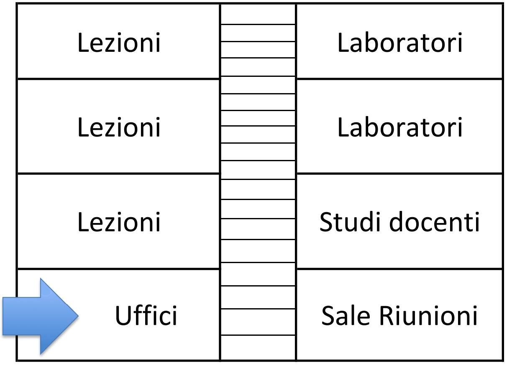
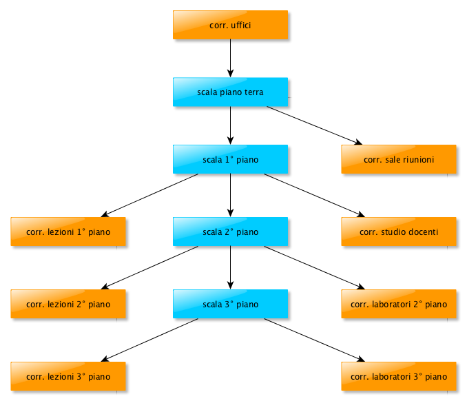

== Sperimentazione

Si ripropone qui di seguito un esempio utilizzato per testare il sistema, in cui quest'ultimo è stato utilizzato per creare uno Smart Building Activity Based.

=== Scenario di riferimento
Lo scenario di riferimento è quello di un edificio di un campus, di cui si vuole gestire l'impianto di riscaldamento in maniera intelligente.

La struttura dell'edificio è la seguente:

* vi sono 4 piani;
* delle scale dividono l'edificio in due blocchi;
* un piano e un blocco identificano una zona, che è costituita da un corridoio, delle stanze e un bagno.

I vari spazi dell'edificio sono suddivisi nel seguente modo:

.Struttura dell'edificio

Gli oggetti che consentono il riscaldamento intelligente dell'edificio sono:

* sensori di temperatura e umidità
* fonti di calore comandabili dall'esterno
* interruttori, che vengono attivati quando vi è la presenza di almeno una persona nell'ambiente

I sensori e le fonti di calore sono posizionate in tutti gli ambienti, ovvero nei corridoi, nelle stanze e nelle scale e possono essere presenti in numero variabile a seconda delle esigenze dello specifico ambiente, mentre in ogni stanza è presente un solo interruttore.

=== Obiettivo

L'obiettivo è quello di mantenere le persone all’interno dell'edificio in condizioni termiche di benessere, consumando meno energia possibile, ovvero attivando 
solamente le fonti di calore necessarie.

Ad esempio, sapendo che nel blocco B, al secondo piano in un laboratorio c'è un gruppo di persone al lavoro, l'impianto di riscaldamento dovrà permettere
l'attivazione ed il controllo delle fonti di calore posizionate nel corridoio e nei bagni degli uffici, nelle scale fino al secondo piano, nel corridoio e
nei bagni dei laboratori del secondo piano e nel laboratorio dove vi sono le persone che stanno lavorando.

=== Soluzione sviluppata
Per risolvere la problematica sopra descritta, all'interno dell'edificio è inserito un server CoAP, a cui i sensori di temperatura e umidità mandano le loro
misurazioni e i vari interruttori che segnalano la presenza delle persone richiedono l'attivazione di un servizio, a seconda se essi vengono attivati o 
disattivati. In base al servizio richiesto e alle misure dei sensori, il server invia il segnale di attivazione o
spegnimento a determinate fonti di calore che, quindi, rappresentano gli attuatori del sistema.

Queste ultime sono organizzate in gruppi multicast, dunque il server avrà il vantaggio di interfacciarsi con esse e non con le singole fonti di calore,
portando ad un'efficiente gestione dell'intero sistema, riducendo i ritardi ed ottimizzando le prestazioni del sistema di comunicazione.

Il comportamento di ogni attuatore all'interno del gruppo viene personalizzato mediante l'ausilio dei tag, che verranno inviati dal server CoAP
a seconda della temperatura e dell'umidità presenti all'interno dell'ambiente.

Infatti, se il server dall'interruttore che richiede il servizio deduce a quali gruppi accedere, dalle misurazioni dei sensori ricava quali tag mandargli,
poichè questi ultimi vengono scelti in base alle condizioni climatiche dell'ambiente in cui il gruppo di attuatori è inserito.

I tag possibili per gli attuatori sono "cold", "cold-warm", "warm", "warm-hot", "hot". Predisponendo i vari attuatori con una combinazione di questi vari tag, è possibile ottenere la giusta quantità di fonti di calore attive in base alla necessità climatica del momento, che viene fornita dai sensori.

Per capire quali gruppi di attuatori attivare, invece, viene sfruttata la posizione dell'interruttore dell'illuminazione elettrica. Quest'ultimo, infatti, 
viene attivato quando è presente qualcuno nella stanza e viene disattivato quando non vi è nessuno.

Sfuttando la posizione dell'interrutore, dunque, è possibile decidere quali gruppi di attuatori attivare, perchè da essa vengono dedotti tutti gli ambienti in cui le persone che si trovano in quella stanza vorrebbero accedere e, in particolare, si stabilisce che per delle persone che si trovano in una determinata stanza bisogna riscaldare tutto il percorso che porta a quella determinata stanza e il bagno della zona della stanza.

Il percorso che porta ad una stanza è costituito da:

* il corridoio di ingresso (che è quello presente nella zona degli uffici)
* le scale che portano fino al piano della stanza
* il corridoio della zona della stanza

In base a queste caratteristiche è stato sviluppato un albero che rappresenta la struttura dell'edificio:

.Gerarchia dell'edificio

Nello schema in Figura 5.2 mancano le stanze. Esse sono state omesse per garantire la leggibilità della figura, ma bisogna considerare che i gruppi in arancione hanno come sottogruppi tutte le stanze che il corridoio contiene.

Non sono da considerare invece i bagni, semplicemente perchè essi non hanno bisogno di una trattazione diversa rispetto ai corridoi in quanto, in tutti i 
possibili scenari che possono presentarsi, i riscaldamenti dei bagni vanno sempre attivati insieme a quelli dei corridoi e quindi appartengono allo stesso gruppo multicast.

Quando un interruttore di illuminazione di una stanza viene attivato, dunque, il server parte dal nodo della stanza in cui era presente l'interruttore e 
ripercorre la gerarchia in Figura 5.2 verso l'alto attivando, dunque, il nodo stesso e tutti i suoi antenati.

Ad esempio, se venisse attivato l'interruttore appartenente a un laboratorio appartenente ai laboratori del secondo piano verrebbero attivati i gruppi appartenenti a:

* il laboratorio stesso;
* il corridoio dei laboratori del secondo piano;
* la scala al secondo piano;
* la scala al primo piano;
* la scala al piano terra;
* il corridoio degli uffici.

Quando un interruttore viene disattivato, invece, il server manda il comando a quel gruppo di attuatori di disattivarsi, in modo che le fonti di calori di 
quella stanza si spengano e ripercorre, come in precedenza, la gerarchia verso l'alto e controlla se esiste almeno un figlio attivo per ogni nodo nell'albero mostrato in Figura 5.2.
Se quest'ultima condizione non è vera, allora il server manda il comando di spegnersi anche a quel gruppo, perchè significa che non vi sono persone che stanno in quelle zone o che devono transitarvi.

I sensori devono appartenere a gruppi di sensori che devono essere chiamati come i gruppi di attuatori appartenenti agli attuatori che si trovano nello stesso
ambiente dei sensori stessi. In questo modo si capisce il clima dell'ambiente di ogni gruppo di fonti di calore.

=== Possibili scenari

Gli scenari che sono stati considerati nella sperimentazione di questa tesi sono descritti nelle sezioni seguenti.

==== Mattinata fredda infrasettimanale
Tutte le zone dell'università sono utilizzate, tranne la zona delle riunioni. Nelle sale riunioni, dunque, gli interruttori saranno spenti e dunque il server non accenderà né le singole sale nè il corridoio che porta ad esse nè il bagno della zona riunioni.

I sensori delle varie zone, inoltre, indicano che ci sono una temperatura e un'umidità molto al di sotto della temperatura ottimale e, dunque, sarà necessario riscaldare velocemente gli ambienti.
Il server manderà il tag "cold" ai vari gruppi di attuatori che si trovano nelle zone interessate dalla presenza di studenti, professori e personale tecnico-amministrativo.
Se gli attuatori sono stati impostati in maniera adeguata, tutti sono configurati con il tag "cold" e iniziano a lavorare ad alto regime.

==== Giornata di sola attività amministrativa
In giornate particolari, come ad esempio il 28, il 29 e il 30 Dicembre, gli unici a lavorare all'interno del campus è il personale tecnico-amministrativo.
In queste giornate vi è il maggior risparmio di energia possibile (escludendo quelle dove l'università è completamente chiusa ovviamente),
poichè basterà riscaldare solamente la zona degli uffici, ovvero il bagno della zona degli uffici, il corridoio d'ingresso e gli uffici.

Dalle altre stanze, infatti, gli interruttori risulteranno disattivati e, dunque, non vi sarà nessun gruppo ad essere attivato oltre a quelli citati precedentemente

==== Riunione di dipartimento in una giornata calda
Durante la riunione di dipartimento si presume che la maggior parte delle persone siano impegnate nelle sale riunioni, dunque gli interruttori di queste 
sale saranno accesi. Si ipotizzi però che vi siano dei ricercatori non impegnati in sala riunione e che si trovano in un laboratorio al terzo piano.
In questo caso i gruppi di attuatori attivati saranno quelli appartenti ai seguenti ambienti:

* il corridoio degli uffici
* il bagno degli uffici
* le scale fino al terzo piano
* il corridoio che conduce alle sale riunioni
* le sale riunioni impegnate
* il bagno delle sale riunioni
* il laboratorio impegnato dai ricercatori
* i bagni della zona dei laboratori del terzo piano

Riducendo il numero di ambienti riscaldati, c'è un risparmio in termini di fonti di energia globale utilizzata per il riscaldamento dell'edificio.

Se la giornata è abbastanza calda, quindi il server manda ai gruppi il tag "hot".
Se gli attuatori sono stati impostati in maniera adeguata pochi attuatori hanno il tag "hot", poichè in questa situazione non c'è bisogno di riscaldare molto e,
dunque, si ha la necessità di poche fonti di calore attive.

=== Inserimento dei dati nel sistema

Una volta che sono stati identificati e caratterizzati tutti gli attuatori dell'edificio, questi vengono organizzati in gruppi.
I gruppi di attuatori vengono inseriti nel sistema tramite la voce di menù "New Actuators Group", che si trova all'interno del menù "My devices Groups" - "New Devices Group". In particolare, rispetto ai nomi presenti nella gerarchia di Figura 5.2 sono stati eliminati i punti e gli spazi sono stati sostituiti da un underscore, quindi ad esempio "corr. uffici" è diventato "corr_uffici".

L'inserimento del gruppo "scala piano terra", per esempio, è il seguente:

[source]
----
name: scala_piano_terra
public [Y/n]: y
description (optional): il gruppo che contiene tutti gli attuatori presenti nella scala del piano terra
parent group name (optional): corr_uffici
tag (optional):

IP(optional) : 228.5.6.9
server data:
IP: 127.0.0.1
port: 8081
----

Il gruppo nell'esempio ha il campo tag vuoto, in quanto i tag caratterizzano i singoli attuatori e non il gruppo a cui appartengono, poichè lo scopo di utilizzare i tag è proprio quello di ottenere un comportamento differenziato tra gli attuatori appartenenti allo stesso gruppo.

Ai fini della nostra sperimentazione, oltre ai gruppi visibili nella gerarchia, sono stati inseriti i gruppi "ufficio1" e "ufficio2" come sottogruppi del gruppo "corr_uffici" e il gruppo "laboratorio1" come sottogruppo del gruppo "corr_laboratorio_2_piano".

I tag vengono inseriti all'interno di un file xml chiamato "tag.xml", che è presente in ogni attuatore. Quando l'attuatore si accende, legge il contenuto di questo file e carica i tag contenuti al suo interno in un array. Quando arriva un comando dal server, l'attuatore esegue il comando solo se il tag inviato dal server è contenuto all'interno dell'array dei tag.

Ad esempio se in un attuatore si vogliono mettere i tag "hot" e "warm-hot" il file tag.xml sarà il seguente:

[source,xml]
----
<?xml version="1.0" encoding="UTF-8"?>
<tags>
  <tag>hot</tag>
  <tag>warm-hot</tag>
</tags>
----

I sensori vengono registrati mediante la voce di menù "Insert new sensor" presente nel sottomenù "Sensors". Si riporta l'esempio di un inserimento di un sensore:

[source]
----
name: sensore_finestra1
server: myserver
public [Y/n]: y
model (optional): SHT15
brand (optional): Sensirion
latitude (optional):
tag (optional):
----

Come si può vedere i campi latitude e tag non sono stati inseriti perchè per questa applicazione non erano utili, ma il loro funzionamento è stato comunque testato a parte ed è risultato funzionante.

I gruppi di sensori vengono inseriti mediante la voce di menù "New Sensors Group", che si trova all'interno del menù "My devices Groups" - "New Devices Group".
Ecco un esempio dell'inserimento del gruppo "ufficio1", che è una stanza del gruppo "corr_uffici".

[source]
----
name: ufficio1
public [Y/n]: y
description (optional): gruppo che contiene tutti i sensori presenti nella stanza "ufficio1"
parent group name (optional): corr_uffici
tag (optional):
----

I sensori vengono aggiunti ai gruppi mediante la voce di menù "Add sensor to group" presente nel sottomenù "Sensors". Di seguito si riporta l'esempio effettuato per aggiungere il gruppo "sensore_finestra1" al gruppo "ufficio1".

[source]
----
sensor name: sensore_finestra1
group name: ufficio1
----

All'interno file di configurazione xml dell'interruttore chiamato "conf_interrutore.xml", invece, il campo locazione corrisponde al nome del gruppo della stanza in cui esso è inserito. Quando l'interruttore si accende, legge la locazione all'interno di questo file e la carica in una variabile in memoria. Ogni volta che l'interruttore viene attivato o disattivato, insieme al suo stato invia anche il contenuto di questa variabile, in modo tale da indicare la posizione dell'interruttore.

Ad esempio per la stanza "ufficio1", il file di configurazione si presenterà semplicemente così:

[source]
----
<?xml version="1.0"?>
<root>
    <locazione>salone1</locazione>
</root>
----
